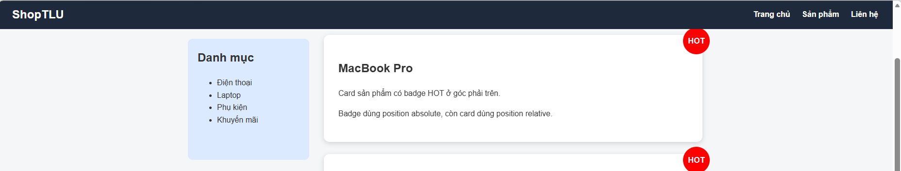
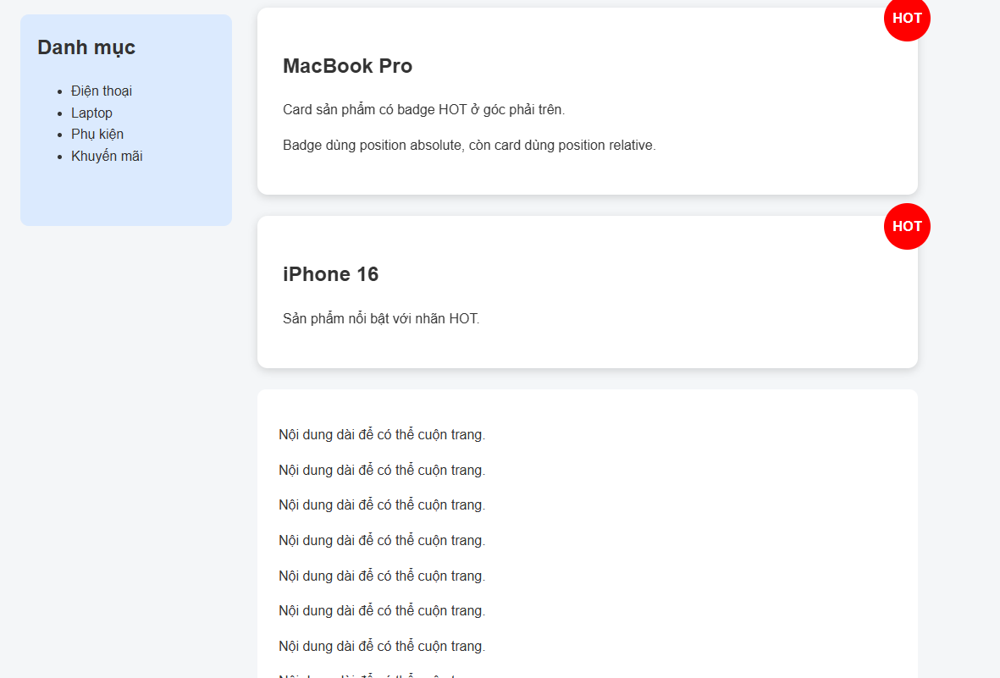
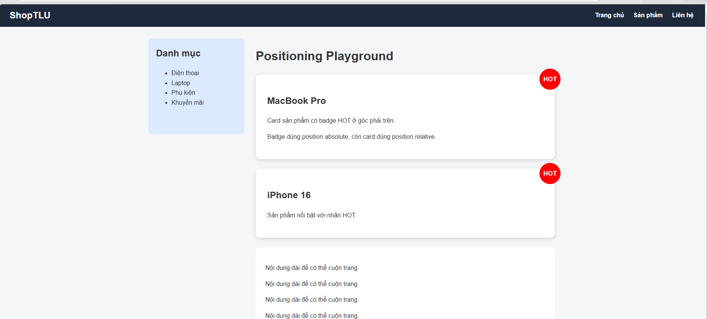
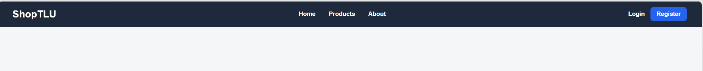
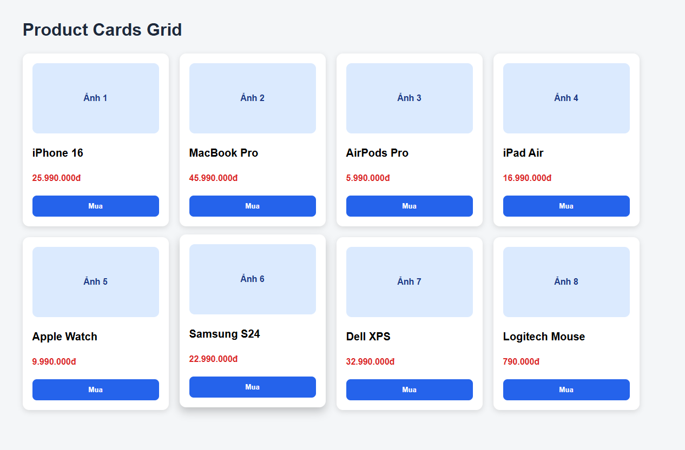
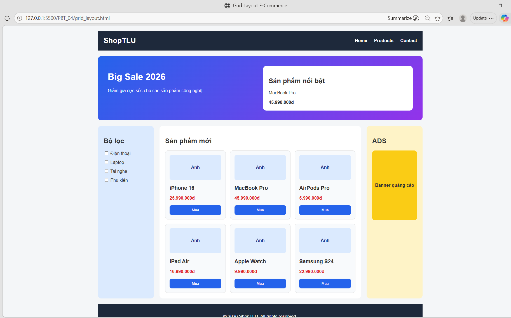

# PHẦN A — KIỂM TRA ĐỌC HIỂU

# Câu A1 — 5 Loại Positioning

| Position | Vẫn chiếm chỗ trong flow? | Tham chiếu vị trí | Cuộn theo trang? | Use case |
|----------|---------------------------|-------------------|------------------|----------|
| static | Có | Theo flow mặc định của HTML | Có | Layout thông thường |
| relative | Có | Chính vị trí ban đầu của phần tử | Có | Dịch chuyển nhẹ phần tử, làm mốc cho absolute |
| absolute | Không | Parent gần nhất có position khác static | Có | Tooltip, popup, badge |
| fixed | Không | Cửa sổ trình duyệt (viewport) | Không | Nút lên đầu trang, menu cố định |
| sticky | Có | Theo vị trí ban đầu rồi bám viewport | Không (khi đã sticky) | Thanh menu bám khi cuộn |

---

## Giải thích từng loại
### 1. static

```css
position: static;
```

- Đây là giá trị mặc định.
- Element hiển thị theo thứ tự HTML.
- Không dùng được:
```css
top
right
bottom
left
```
Ví dụ:
```html
<p>Đoạn văn bình thường</p>
```
Use case:
- Bố cục thông thường.
### 2. relative
```css
position: relative;
```
- Element vẫn giữ chỗ trong layout.
- Có thể dịch chuyển bằng:

```css
top
left
right
bottom
```

Ví dụ:

```css
.box {
    position: relative;
    left: 30px;
}
```

Use case:
- Dịch chuyển nhẹ phần tử
- Làm mốc cho absolute

### 3. absolute
```css
position: absolute;
```
- Phần tử bị tách khỏi flow.
- Không chiếm chỗ.

Ví dụ
```css
.badge {
    position: absolute;
    top: 0;
    right: 0;
}
```

Use case:
- Tooltip
- Popup
- Badge sản phẩm

### 4. fixed

```css
position: fixed;
```

- Phần tử bám theo màn hình.
- Không cuộn cùng nội dung.

Ví dụ:

```css
.back-to-top {
    position: fixed;
    right: 20px;
    bottom: 20px;
}
```

Use case:
- Nút lên đầu trang
- Thanh chat
- Header cố định

### 5. sticky

```css
position: sticky;
top: 0;
```

- Ban đầu hoạt động như relative.
- Khi cuộn đến ngưỡng sẽ giống fixed.

Ví dụ:

```css
.menu {
    position: sticky;
    top: 0;
}
```

Use case:
- Header bám
- Menu điều hướng

# Câu hỏi thêm
## Khi nào absolute tham chiếu body?

Absolute sẽ tham chiếu tới body (hoặc viewport) khi:
KHÔNG tồn tại phần tử cha nào có:

```css
position:
relative
absolute
fixed
sticky
```
Ví dụ:
```html
<body>

<div class="box">
    <div class="item"></div>
</div>

</body>
```
```css
.item {
    position: absolute;
    top: 0;
    left: 0;
}
```

→ `.item` sẽ căn theo body.

---

## Khi nào absolute tham chiếu parent?
Khi phần tử cha gần nhất có:

```css
position: relative;
```

Ví dụ:

```html
<div class="parent">

<div class="child">
</div>

</div>
```

```css
.parent {
    position: relative;
}

.child {
    position: absolute;
    top: 10px;
    left: 10px;
}
```

→ `.child` căn theo `.parent`

---

## Khái niệm nearest positioned ancestor
Nearest positioned ancestor là:

Phần tử cha gần nhất có:

```css
position:
relative
absolute
fixed
sticky
```

Element `absolute` sẽ lấy phần tử đó làm mốc định vị.
Ví dụ:

```html
<div class="grandparent">

<div class="parent">

<div class="child"></div>

</div>

</div>
```

```css
.grandparent {
position: relative;
}

.parent {
position: static;
}

.child {
position: absolute;
top: 0;
left: 0;
}
```

→ child tham chiếu `.grandparent`
vì `.parent` đang là static.

# Câu A2 — Flexbox vs Grid

## Trường hợp 1

```css
.container {
    display: flex;
}

.item {
    flex: 1;
}
```

Có 4 items.

### Dự đoán bố cục

- `display: flex` → mặc định xếp theo hàng ngang
- `flex: 1` → các item chia đều chiều rộng

Kết quả:

```text
┌────┬────┬────┬────┐
│ 1  │ 2  │ 3  │ 4  │
└────┴────┴────┴────┘
```

→ 1 hàng, 4 cột  
→ Mỗi item rộng bằng nhau

---

## Trường hợp 2

```css
.container {
    display: flex;
    flex-wrap: wrap;
}

.item {
    width: 45%;
    margin: 2.5%;
}
```

Có 6 items.

### Phân tích

Mỗi item:

```text
45% + 2.5% + 2.5%
=
50%
```

→ mỗi hàng chứa 2 item

Có 6 item:

```text
6 ÷ 2 = 3 hàng
```

### Dự đoán bố cục

```text
┌────────┬────────┐
│   1    │   2    │
├────────┼────────┤
│   3    │   4    │
├────────┼────────┤
│   5    │   6    │
└────────┴────────┘
```

→ 3 hàng, 2 cột

---

## Trường hợp 3

```css
.container {
    display: flex;

    justify-content: space-between;

    align-items: center;
}
```

Có 3 items.

### Phân tích

`justify-content: space-between`

→ item đầu sát trái

→ item cuối sát phải

→ item giữa nằm chính giữa

`align-items: center`

→ căn giữa theo chiều dọc

### Dự đoán bố cục

```text
┌─────────────────────┐
│ 1        2        3 │
│                     │
│ (căn giữa chiều dọc)│
└─────────────────────┘
```

→ 1 hàng

→ khoảng cách đều

---

## Trường hợp 4

```css
.container {
    display: grid;

    grid-template-columns:
    200px
    1fr
    200px;

    gap: 20px;
}
```

Có 3 items.

### Phân tích

Grid tạo:

```text
Cột 1 = 200px
Cột 2 = phần còn lại
Cột 3 = 200px
```

### Dự đoán bố cục

```text
┌──────┬────────────┬──────┐
│  1   │     2      │  3   │
└──────┴────────────┴──────┘
```

→ 1 hàng

→ 3 cột

→ giữa co giãn

---

## Trường hợp 5

```css
.container {
    display: grid;

    grid-template-columns:
    repeat(3, 1fr);

    gap: 10px;
}
```

Có 7 items.

### Phân tích

Grid tạo:

```text
3 cột bằng nhau
```

Sắp item:

```text
1 2 3
4 5 6
7
```

### Dự đoán bố cục

```text
┌────┬────┬────┐
│ 1  │ 2  │ 3  │
├────┼────┼────┤
│ 4  │ 5  │ 6  │
├────┼────┼────┤
│ 7  │    │    │
└────┴────┴────┘
```

→ 3 hàng

→ 3 cột

→ item cuối nằm:

```text
Hàng 3 — Cột 1
```

---

## So sánh nhanh

### Flexbox
- Phù hợp layout 1 chiều
- Theo hàng hoặc cột

### Grid
- Phù hợp layout 2 chiều
- Điều khiển hàng và cột tốt hơn

# Bài B1 — Positioning Playground
## Các file đã tạo
- positioning.html
- positioning.css

## Các kỹ thuật position đã sử dụng
### 1. Fixed header
```css
.fixed-header {
    position: fixed;
    top: 0;
    width: 100%;
    height: 60px;
}
```
Header luôn nằm trên cùng màn hình khi cuộn trang.
2. Sticky sidebar
```css
.sidebar {
    position: sticky;
    top: 80px;
}
```
Sidebar sẽ dính lại khi cuộn xuống và nằm dưới header.
3. Badge HOT dùng absolute
```css
.product-card {
    position: relative;
}

.badge {
    position: absolute;
    top: -15px;
    right: -15px;
}
```
Card là mốc định vị, badge HOT nằm ở góc phải trên của card.
4. Scroll to top button
```css
.scroll-top {
    position: fixed;
    right: 25px;
    bottom: 25px;
}
```
Nút luôn cố định ở góc phải dưới màn hình.
## Screenshot

Header fixed khi scroll:



Sidebar sticky khi scroll:



Badge HOT trên card:




# Bài B2 — Flexbox Navigation & Cards

## Phần 1 — Navbar

## Các file đã tạo

- flexbox_layout.html
- flexbox.css

## Giải thích Flexbox

Navbar sử dụng:

```css
.navbar {
    display: flex;
    align-items: center;
    justify-content: space-between;
}
```
Trong đó:
    `display: flex `giúp các phần tử nằm ngang
    `align-items: center` giúp căn giữa theo chiều dọc
    `justify-content: space-between` đẩy logo sang trái, menu ở giữa và nút login/register sang phải

Menu sử dụng:
```css
.menu {
    display: flex;
    gap: 35px;
}
```
để các item nằm ngang và cách đều nhau.
Hiệu ứng hover:
```css
.menu a:hover,
.auth-buttons a:hover {
    color: #facc15;
    text-decoration: underline;
}
```
Khi rê chuột vào link, link đổi màu và có gạch chân.
## Screenshot


## Phần 2 — Product Cards Grid

Lưới sản phẩm sử dụng Flexbox:

```css
.products-container {
    display: flex;
    flex-wrap: wrap;
    gap: 20px;
}
Mỗi card sử dụng:
```css
.product-card {
    flex: 0 0 calc(25% - 20px);
}
```
Điều này giúp tạo bố cục 4 cột.
Bên trong card cũng dùng Flexbox theo chiều dọc:
```css
.product-card {
    display: flex;
    flex-direction: column;
}
```
Nút mua được đẩy xuống đáy card bằng:
```css
.product-card button {
    margin-top: auto;
}
```
Hiệu ứng hover:
```css
.product-card:hover {
    transform: translateY(-5px);
    box-shadow: 0 8px 18px rgba(0,0,0,0.22);
}
```


# Bài B3 — Grid Layout — Trang E-Commerce

## Các file đã tạo

- grid_layout.html
- grid.css

## Layout chính dùng CSS Grid

```css
.page-grid {
    display: grid;
    grid-template-columns: 200px minmax(0, 1fr) 200px;
    grid-template-areas:
        "header header header"
        "hero hero hero"
        "sidebar main ads"
        "footer footer footer";
    gap: 20px;
}
```
Layout chính gồm 3 cột:
    200px 1fr 200px

Trong đó:
    Cột trái là sidebar
    Cột giữa là main content
    Cột phải là ads
Header, Hero, Footer full width
```css
.header,
.hero,
.footer {
    grid-column: 1 / -1;
}
```
Nghĩa là các phần này kéo dài từ cột đầu tiên đến cột cuối cùng.
Sidebar

Sidebar chứa các checkbox giả lập bộ lọc:
```html
<label><input type="checkbox"> Điện thoại</label>
<label><input type="checkbox"> Laptop</label>
<label><input type="checkbox"> Tai nghe</label>
<label><input type="checkbox"> Phụ kiện</label>
```
Main content có Grid con 3 cột
```css
.products-grid {
    display: grid;
    grid-template-columns: repeat(3, minmax(0, 1fr));
    gap: 15px;
}
```
Main content hiển thị 6 product cards theo dạng 3 cột, 2 hàng.

Ads
Khu vực ads là aside bên phải, chứa banner quảng cáo giả lập.

Bonus

Bài có sử dụng grid-template-areas với named areas:
```css
grid-template-areas:
    "header header header"
    "hero hero hero"
    "sidebar main ads"
    "footer footer footer";
```
Hero banner có card sản phẩm nổi bật.


# PHẦN C — SUY LUẬN

# Câu C1 — Flexbox vs Grid: Khi nào dùng gì?

## 1. Navigation bar ngang

Tình huống:

```text
Logo + menu + buttons
```

Nên dùng: **Flexbox**

### Giải thích

Navigation bar là layout theo 1 chiều ngang. Flexbox phù hợp để căn các phần tử trên cùng một hàng, căn giữa theo chiều dọc và tạo khoảng cách giữa logo, menu, button.

Ví dụ:

```css
.navbar {
    display: flex;
    justify-content: space-between;
    align-items: center;
}
```

---

## 2. Lưới ảnh Instagram

Tình huống:

```text
3 cột đều nhau, số ảnh không biết trước
```

Nên dùng: **Grid**

### Giải thích

Lưới ảnh Instagram là layout 2 chiều gồm hàng và cột. CSS Grid phù hợp hơn vì có thể chia cột rõ ràng và tự động đẩy ảnh xuống hàng mới.

Ví dụ:

```css
.gallery {
    display: grid;
    grid-template-columns: repeat(3, 1fr);
    gap: 10px;
}
```

---

## 3. Layout blog

Tình huống:

```text
Main content + sidebar
```

Nên dùng: **Grid**

### Giải thích

Layout blog gồm nhiều vùng lớn trên trang, ví dụ main content và sidebar. Đây là bố cục theo cột nên Grid phù hợp để chia vùng chính xác hơn.

Ví dụ:

```css
.blog-layout {
    display: grid;
    grid-template-columns: 1fr 300px;
    gap: 20px;
}
```

---

## 4. Footer với 4 cột thông tin

Tình huống:

```text
Về chúng tôi | Liên kết | Hỗ trợ | Liên hệ
```

Nên dùng: **Grid**

### Giải thích

Footer có 4 cột thông tin đều nhau. Grid phù hợp để chia thành nhiều cột ổn định và dễ responsive.

Ví dụ:

```css
.footer {
    display: grid;
    grid-template-columns: repeat(4, 1fr);
    gap: 20px;
}
```

---

## 5. Card sản phẩm

Tình huống:

```text
Ảnh trên
Text giữa
Nút dưới
Nút luôn dính đáy
```

Nên dùng: **Flexbox**

### Giải thích

Bên trong card, các phần tử xếp theo một chiều dọc. Flexbox phù hợp để xếp ảnh, text, button theo cột. Có thể dùng `margin-top: auto` để đẩy nút xuống đáy card.

Ví dụ:

```css
.product-card {
    display: flex;
    flex-direction: column;
}

.product-card button {
    margin-top: auto;
}
```

---

## Kết luận

- Dùng **Flexbox** khi layout theo 1 chiều: ngang hoặc dọc.
- Dùng **Grid** khi layout theo 2 chiều: hàng và cột.
- Có thể **kết hợp cả hai** trong một trang web:
    - Grid để chia bố cục lớn.
    - Flexbox để căn chỉnh bên trong từng thành phần nhỏ.
    