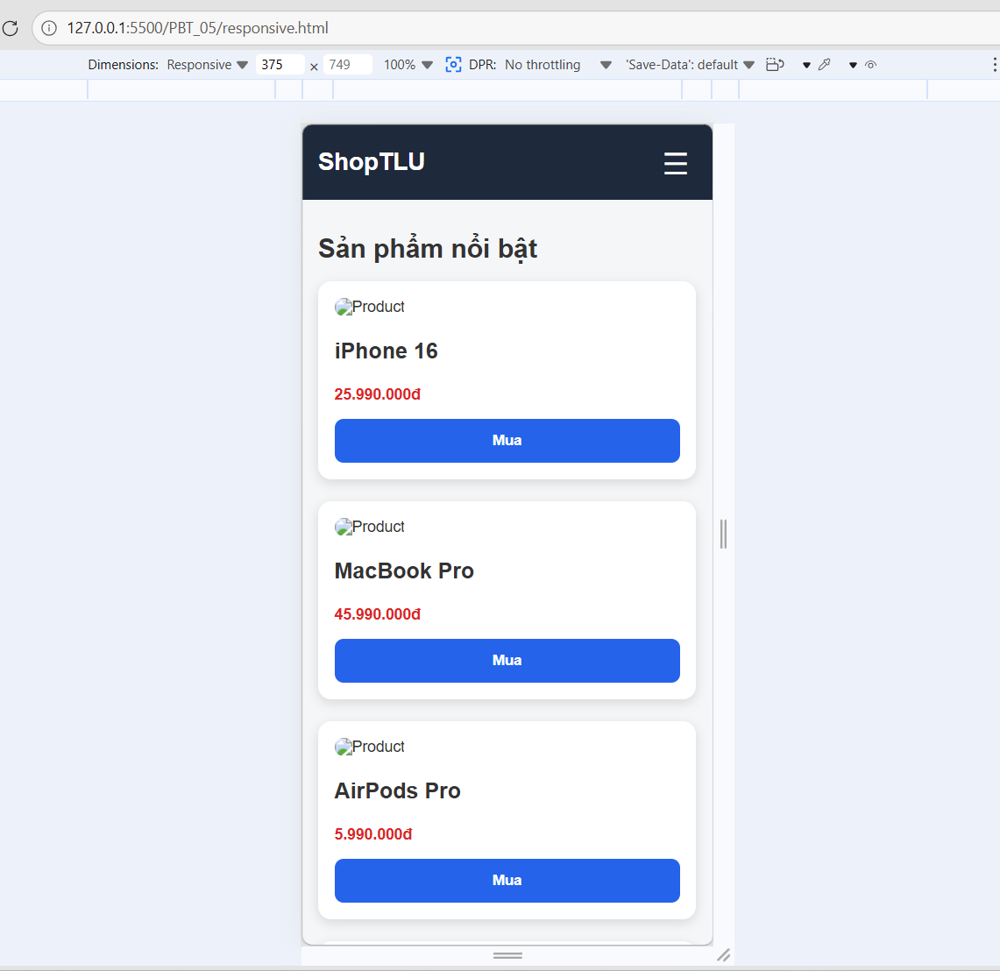
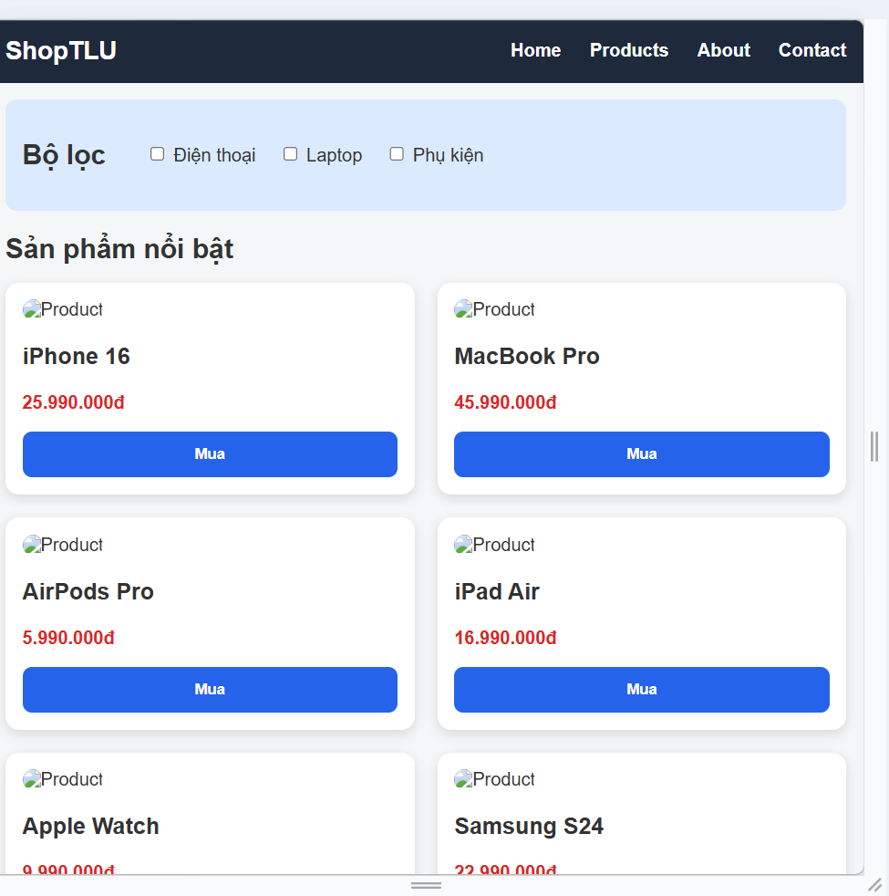
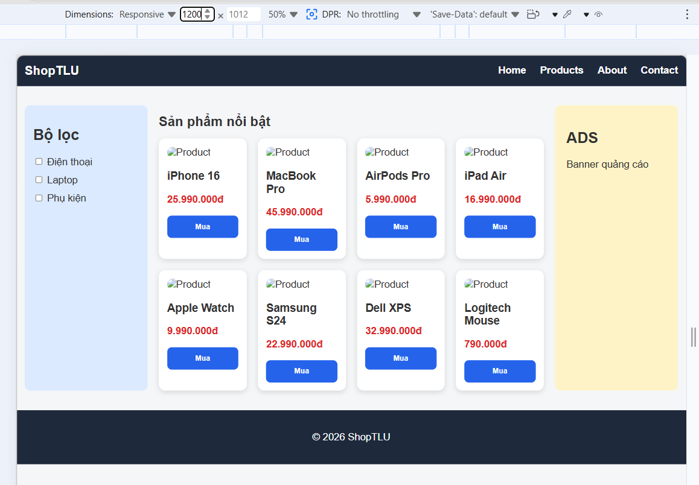
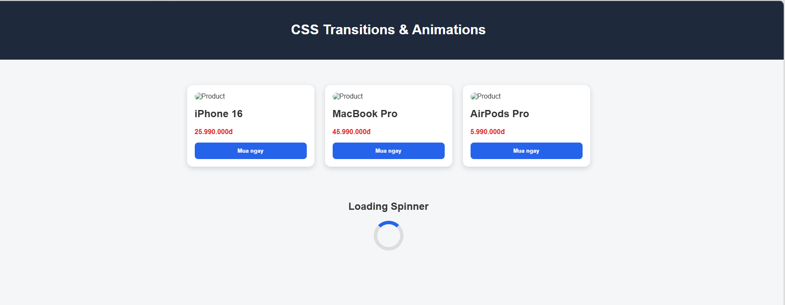
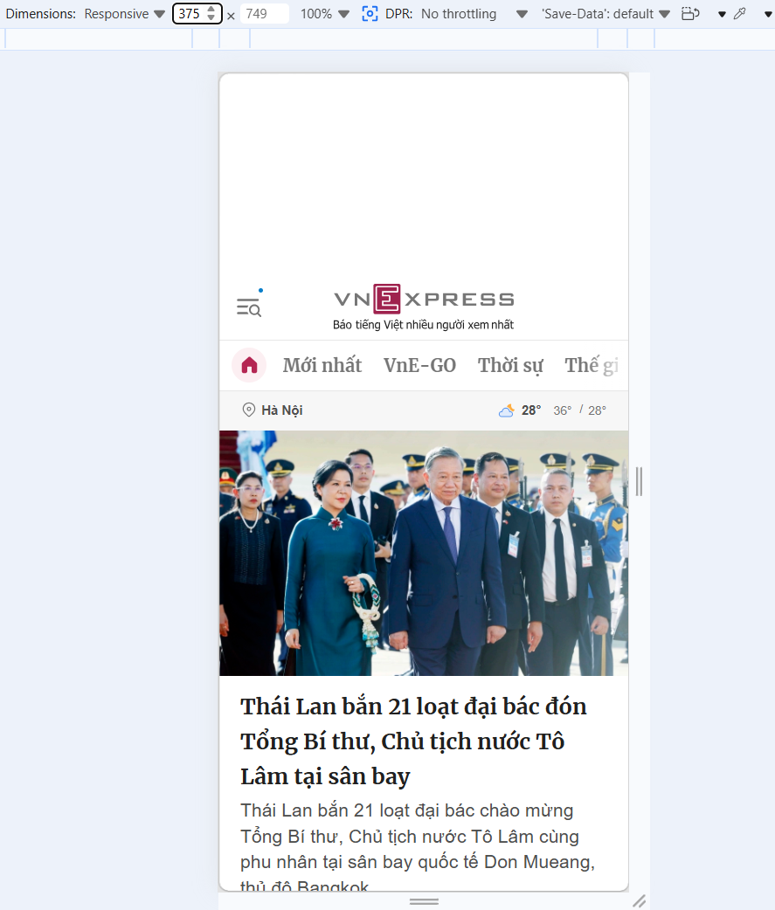
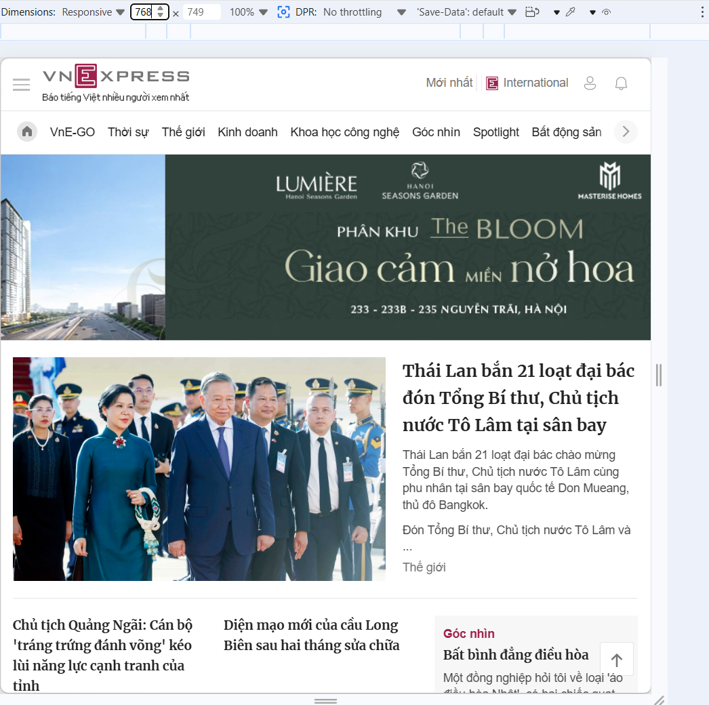
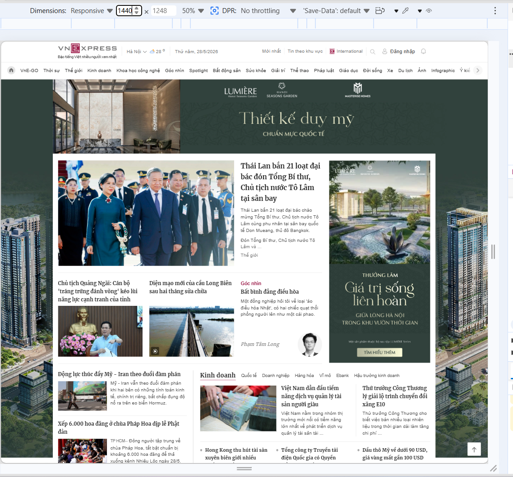

# PHẦN A — KIỂM TRA ĐỌC HIỂU

# Câu A1 — Viewport & Mobile-First

## Thẻ meta viewport chuẩn

```html
<meta name="viewport" content="width=device-width, initial-scale=1.0">
```

---

## Giải thích từng thuộc tính

### 1. name="viewport"

Cho trình duyệt biết đây là cấu hình viewport cho thiết bị di động.

Viewport là vùng hiển thị nội dung trang web trên màn hình.

---

### 2. width=device-width

Thiết lập chiều rộng viewport bằng đúng chiều rộng màn hình thiết bị.

Ví dụ:
- iPhone nhỏ → viewport nhỏ
- iPad → viewport lớn hơn

Điều này giúp website responsive đúng kích thước thiết bị.

---

### 3. initial-scale=1.0

Thiết lập mức zoom ban đầu là 100%.

Trang web sẽ hiển thị với tỉ lệ bình thường khi mở lần đầu.

---

# Nếu thiếu thẻ viewport thì điều gì xảy ra?

Nếu không có:

```html
<meta name="viewport">
```

iPhone và nhiều thiết bị mobile sẽ giả lập trang web như desktop với chiều rộng khoảng:

```text
980px
```

Hậu quả:

- Website bị thu nhỏ
- Chữ rất nhỏ
- Người dùng phải zoom mới đọc được
- Responsive layout hoạt động sai

Ví dụ:
- Navbar bị co nhỏ
- Button rất bé
- Layout mobile không đúng

---

# Mobile-First vs Desktop-First

## 1. Mobile-First

### Ý tưởng

Viết CSS cho mobile trước.

Sau đó dùng:

```css
@media (min-width: ...)
```

để mở rộng cho tablet và desktop.

---

### Ví dụ Mobile-First với breakpoint 768px

```css
body {
    font-size: 14px;
}

.container {
    display: block;
}

@media (min-width: 768px) {

    body {
        font-size: 18px;
    }

    .container {
        display: flex;
    }
}
```

### Giải thích

- Mobile dùng layout đơn giản trước
- Khi màn hình ≥ 768px thì chuyển sang layout desktop

---

## 2. Desktop-First

### Ý tưởng

Viết CSS cho desktop trước.

Sau đó dùng:

```css
@media (max-width: ...)
```

để thu nhỏ cho mobile.

---

### Ví dụ Desktop-First với breakpoint 768px

```css
body {
    font-size: 18px;
}

.container {
    display: flex;
}

@media (max-width: 768px) {

    body {
        font-size: 14px;
    }

    .container {
        display: block;
    }
}
```

### Giải thích

- Desktop là mặc định
- Khi màn hình nhỏ hơn 768px thì đổi sang layout mobile

---

# Mobile-First được khuyên dùng vì sao?

## 1. Mobile hiện là thiết bị phổ biến nhất

Phần lớn người dùng truy cập web bằng điện thoại.

---

## 2. Hiệu năng tốt hơn

Mobile chỉ tải CSS cần thiết trước.

Desktop sẽ nhận thêm CSS mở rộng sau.

---

## 3. CSS dễ mở rộng hơn

Bắt đầu từ layout đơn giản rồi mở rộng dần sẽ dễ quản lý hơn.

---

## 4. Responsive tự nhiên hơn

Thiết kế từ màn hình nhỏ trước giúp:
- tránh layout vỡ
- tránh nội dung quá lớn
- cải thiện trải nghiệm mobile

---

# Kết luận

- `meta viewport` rất quan trọng với responsive web design.
- Mobile-First là phương pháp hiện đại và được khuyên dùng.
- Responsive website nên thiết kế cho mobile trước rồi mở rộng lên desktop.

# Câu A2 — Breakpoints

## Các breakpoints phổ biến

| Breakpoint | Kích thước | Thiết bị đại diện | Ví dụ lưới sản phẩm |
|---|---|---|---|
| Extra Small (XS) | < 576px | Điện thoại nhỏ | 1 cột |
| Small (SM) | ≥ 576px | Điện thoại lớn | 2 cột |
| Medium (MD) | ≥ 768px | Tablet | 2 hoặc 3 cột |
| Large (LG) | ≥ 992px | Laptop | 3 hoặc 4 cột |
| Extra Large (XL) | ≥ 1200px | Desktop lớn | 4 cột |
| Extra Extra Large (XXL) | ≥ 1400px | Màn hình rất lớn | 5 hoặc 6 cột |

---

# Giải thích từng breakpoint

## 1. XS — Extra Small

```text
< 576px
```

### Thiết bị
- Điện thoại nhỏ
- iPhone SE
- Android nhỏ

### Layout phù hợp
- Menu dọc
- 1 cột sản phẩm
- Chữ lớn dễ đọc

Ví dụ:

```text
┌──────┐
│Card 1│
├──────┤
│Card 2│
└──────┘
```

---

## 2. SM — Small

```text
≥ 576px
```

### Thiết bị
- Điện thoại lớn

### Layout phù hợp
- 2 cột sản phẩm

Ví dụ:

```text
┌────┬────┐
│ 1  │ 2  │
├────┼────┤
│ 3  │ 4  │
└────┴────┘
```

---

## 3. MD — Medium

```text
≥ 768px
```

### Thiết bị
- Tablet
- iPad

### Layout phù hợp
- 2 hoặc 3 cột sản phẩm
- Sidebar có thể bắt đầu xuất hiện

Ví dụ:

```text
┌────┬────┬────┐
│ 1  │ 2  │ 3  │
└────┴────┴────┘
```

---

## 4. LG — Large

```text
≥ 992px
```

### Thiết bị
- Laptop
- Desktop nhỏ

### Layout phù hợp
- 3 hoặc 4 cột
- Có sidebar và ads

Ví dụ:

```text
┌────┬────┬────┬────┐
│ 1  │ 2  │ 3  │ 4  │
└────┴────┴────┴────┘
```

---

## 5. XL — Extra Large

```text
≥ 1200px
```

### Thiết bị
- Desktop lớn

### Layout phù hợp
- 4 cột sản phẩm
- Khoảng trắng lớn hơn

---

## 6. XXL — Extra Extra Large

```text
≥ 1400px
```

### Thiết bị
- Màn hình ultrawide
- Monitor lớn

### Layout phù hợp
- 5 hoặc 6 cột
- Dashboard lớn

---

# Ví dụ media query

```css
@media (min-width: 768px) {

    .products {
        grid-template-columns: repeat(3, 1fr);
    }
}
```

---

# Kết luận

Breakpoints giúp website responsive trên nhiều thiết bị khác nhau:
- Mobile
- Tablet
- Laptop
- Desktop

Mỗi kích thước màn hình nên có layout phù hợp để cải thiện trải nghiệm người dùng.
# Câu A3 — Media Queries

## CSS đề bài

```css
.container {
    width: 100%;
    padding: 10px;
}

@media (min-width: 576px) {
    .container {
        width: 540px;
    }
}

@media (min-width: 768px) {
    .container {
        width: 720px;
    }
}

@media (min-width: 992px) {
    .container {
        width: 960px;
    }
}

@media (min-width: 1200px) {
    .container {
        width: 1140px;
    }
}
```

---

# Bảng kết quả

| Chiều rộng màn hình | .container width |
|---|---|
| 375px (iPhone SE) | 100% |
| 600px | 540px |
| 800px | 720px |
| 1000px | 960px |
| 1400px | 1140px |

---

# Giải thích từng trường hợp

## 1. Màn hình 375px

```text
375px < 576px
```

Không media query nào hoạt động.

Áp dụng CSS mặc định:

```css
.container {
    width: 100%;
}
```

→ `.container width = 100%`

---

## 2. Màn hình 600px

```text
600px ≥ 576px
```

Media query đầu tiên hoạt động:

```css
@media (min-width: 576px) {
    .container {
        width: 540px;
    }
}
```

→ `.container width = 540px`

---

## 3. Màn hình 800px

```text
800px ≥ 768px
```

Media query 768px ghi đè media query trước.

```css
@media (min-width: 768px) {
    .container {
        width: 720px;
    }
}
```

→ `.container width = 720px`

---

## 4. Màn hình 1000px

```text
1000px ≥ 992px
```

Media query 992px hoạt động:

```css
@media (min-width: 992px) {
    .container {
        width: 960px;
    }
}
```

→ `.container width = 960px`

---

## 5. Màn hình 1400px

```text
1400px ≥ 1200px
```

Media query cuối cùng hoạt động:

```css
@media (min-width: 1200px) {
    .container {
        width: 1140px;
    }
}
```

→ `.container width = 1140px`

---

# Kết luận

Trong Mobile-First:

- CSS mặc định áp dụng cho mobile
- Media queries với `min-width` sẽ ghi đè dần khi màn hình lớn hơn
- Rule viết sau sẽ ghi đè rule trước nếu cùng target

# Câu A4 — SCSS Basics

## 1. Variables

### Khái niệm

SCSS cho phép tạo biến để lưu giá trị dùng nhiều lần như:
- màu sắc
- font-size
- spacing

Variables giúp:
- dễ bảo trì
- sửa một nơi, cập nhật toàn bộ

---

### Ví dụ

```scss
$primary-color: #2563eb;
$text-color: #333;

button {
    background-color: $primary-color;
    color: $text-color;
}
```

Sau khi compile thành CSS:

```css
button {
    background-color: #2563eb;
    color: #333;
}
```

---

## 2. Nesting

### Khái niệm

SCSS cho phép viết CSS lồng nhau giống cấu trúc HTML.

Giúp:
- code dễ đọc
- nhóm style liên quan lại với nhau

---

### Ví dụ

```scss
.navbar {

    background: #1e293b;

    a {
        color: white;

        &:hover {
            color: yellow;
        }
    }
}
```

Compile thành CSS:

```css
.navbar {
    background: #1e293b;
}

.navbar a {
    color: white;
}

.navbar a:hover {
    color: yellow;
}
```

---

## 3. Mixins

### Khái niệm

Mixin là khối CSS có thể tái sử dụng nhiều lần.

Giúp:
- tránh lặp code
- dễ quản lý responsive hoặc flexbox

---

### Ví dụ

```scss
@mixin flex-center {

    display: flex;
    justify-content: center;
    align-items: center;
}

.box {
    @include flex-center;
}
```

Compile thành CSS:

```css
.box {
    display: flex;
    justify-content: center;
    align-items: center;
}
```

---

## 4. @extend / Inheritance

### Khái niệm

`@extend` cho phép một class kế thừa style của class khác.

Giúp:
- tái sử dụng CSS
- giảm lặp code

---

### Ví dụ

```scss
.button-base {

    padding: 10px;
    border-radius: 8px;
}

.primary-button {

    @extend .button-base;

    background: blue;
    color: white;
}
```

Compile thành CSS:

```css
.button-base,
.primary-button {
    padding: 10px;
    border-radius: 8px;
}

.primary-button {
    background: blue;
    color: white;
}
```

---

# Tại sao trình duyệt không đọc được file .scss?

Trình duyệt chỉ hiểu:

```text
CSS
```

SCSS là ngôn ngữ mở rộng của CSS có thêm:
- variables
- nesting
- mixins
- functions

Các tính năng này trình duyệt không hiểu trực tiếp.

Ví dụ:

```scss
$primary-color: blue;
```

không phải cú pháp CSS chuẩn.

---

# Cần bước gì để chuyển SCSS → CSS?

Cần:

```text
Compile SCSS thành CSS
```

bằng Sass compiler.

Ví dụ:

```bash
sass style.scss style.css
```

hoặc dùng:
- VS Code Live Sass Compiler
- Webpack
- Vite
- Parcel

---

# Quy trình hoạt động

```text
style.scss
↓ compile
style.css
↓
Browser đọc CSS
```

---

# Kết luận

SCSS giúp:
- code ngắn gọn hơn
- tái sử dụng tốt hơn
- dễ bảo trì hơn CSS thường

Nhưng cần compile sang CSS trước khi trình duyệt có thể sử dụng.

# Bài B1 — Responsive Product Page

## Các file đã tạo

- responsive.html
- responsive.css

## Mobile-First

CSS mặc định được viết cho mobile trước:

```css
.product-grid {
    grid-template-columns: 1fr;
}

.sidebar,
.ads {
    display: none;
}
```
Mobile hiển thị:
    hamburger menu
    1 cột sản phẩm
    ẩn sidebar và ads
Tablet breakpoint
```css 
@media (min-width: 768px) {
    .product-grid {
        grid-template-columns: repeat(2, 1fr);
    }
}
```
Tablet hiển thị:
    menu ngang
    sidebar dạng ngang
    sản phẩm 2 cột
Desktop breakpoint
```css
@media (min-width: 1024px) {
    .layout {
        display: grid;
        grid-template-columns: 220px 1fr 220px;
    }

    .product-grid {
        grid-template-columns: repeat(4, 1fr);
    }
}
```
Desktop hiển thị:
    sidebar trái
    product grid 4 cột
    ads bên phải
Ảnh responsive
```css
.card img {
    max-width: 100%;
    height: auto;
}
```
Ảnh tự co giãn theo kích thước card.
## Screenshot

Mobile 375px:



Tablet 768px:



Desktop 1200px:



# Bài B2 — CSS Transitions & Animations

## Các file đã tạo

- animations.html
- animations.css

## 1. Card hover effect

```css
.card {
    transition: all 0.3s ease;
}

.card:hover {
    transform: translateY(-8px);
    box-shadow: 0 12px 25px rgba(0,0,0,0.28);
}
```
## 2. Button hover
```css
.card button {
    transition: all 0.3s ease;
}

.card button:hover {
    background-color: #facc15;
    color: #1e293b;
    transform: scale(1.05);
}
```
## 3. Image zoom
```css
.image-box {
    overflow: hidden;
}

.image-box img {
    transition: transform 0.3s ease;
}

.card:hover .image-box img {
    transform: scale(1.1);
}
```
## 4. Loading spinner
```css 
.spinner {
    border: 8px solid #ddd;
    border-top: 8px solid #2563eb;
    border-radius: 50%;
    animation: spin 1s linear infinite;
}
```
## 5. Fade-in animation
```css 
.fade-in {
    animation: fadeIn 1s ease forwards;
}
```
## Screenshot


# Bài B3 — SCSS Refactor

## Cấu trúc file

```text
scss/
├── _variables.scss
├── _mixins.scss
├── _components.scss
└── style.scss
```
## Variables

File _variables.scss có các biến:
```scss
$primary-color: #2563eb;
$secondary-color: #facc15;
$danger-color: #dc2626;
$dark-color: #1e293b;
$light-color: #f4f6f8;
$white-color: #ffffff;
$font-primary: Arial, sans-serif;
$breakpoint-tablet: 768px;
$breakpoint-desktop: 1024px;
$spacing-sm: 8px;
$spacing-md: 16px;
$spacing-lg: 32px;
$border-radius: 12px;
```
## Nesting

Ví dụ nesting trong `.card`:
```css
.card {
    .card-image {
        max-width: 100%;
    }

    .card-title {
        font-size: 20px;
    }

    &:hover {
        transform: translateY(-5px);
    }

    &.featured {
        border: 2px solid $secondary-color;
    }
}
```
## Mixins

Có 3 mixins:
```scss
@mixin respond-to($breakpoint) {
    @if $breakpoint == tablet {
        @media (min-width: $breakpoint-tablet) {
            @content;
        }
    }

    @if $breakpoint == desktop {
        @media (min-width: $breakpoint-desktop) {
            @content;
        }
    }
}

@mixin flex-center {
    display: flex;
    justify-content: center;
    align-items: center;
}

@mixin card-shadow {
    box-shadow: 0 4px 12px rgba(0, 0, 0, 0.15);
}
```
## Partial & Import

File chính style.scss import các partial:
```scss
@import "variables";
@import "mixins";
@import "components";
```
## Lệnh compile SCSS sang CSS

Nếu dùng Sass CLI:

sass scss/style.scss style.css

Hoặc nếu muốn tự động theo dõi thay đổi:

sass --watch scss/style.scss:style.css
## Kết luận

Bài đã sử dụng:

    Variables để quản lý màu, font, spacing, breakpoint
    Nesting để viết CSS gọn hơn
    Mixins cho responsive, flex center và shadow
    Partials để chia file SCSS rõ ràng
    Compile SCSS thành CSS trước khi trình duyệt đọc được

    
# PHẦN C — PHÂN TÍCH

# Câu C1 — Phân tích trang web thực

## Trang web được chọn

Trang web được chọn: **VNExpress**

Các kích thước kiểm tra:

- Mobile: 375px
- Tablet: 768px
- Desktop: 1440px

---

## 1. Mobile — 375px

### Navigation thay đổi thế nào?

Ở màn hình mobile, navigation được rút gọn. Các mục menu không hiển thị đầy đủ như desktop. Trang ưu tiên hiển thị logo, một số icon chức năng và nội dung chính.

### Lưới content thay đổi mấy cột?

Content chủ yếu hiển thị **1 cột** để phù hợp với màn hình nhỏ.

### Elements nào bị ẩn trên mobile?

Một số thành phần bị ẩn hoặc rút gọn:
- Menu nhiều chuyên mục
- Sidebar phụ
- Một số quảng cáo
- Một số khối tin phụ

### Font size có thay đổi không?

Font size thường nhỏ hơn desktop nhưng vẫn đủ đọc trên điện thoại. Tiêu đề bài viết nổi bật hơn phần mô tả.

### Screenshot



---

## 2. Tablet — 768px

### Navigation thay đổi thế nào?

Ở tablet, navigation có thể hiển thị nhiều mục hơn mobile nhưng vẫn chưa đầy đủ như desktop. Một số mục phụ vẫn được ẩn hoặc gom lại.

### Lưới content thay đổi mấy cột?

Content thường chuyển sang **2 cột**:
- Cột chính hiển thị tin nổi bật
- Cột phụ hiển thị tin nhỏ hơn hoặc danh sách tin

### Elements nào bị ẩn trên tablet?

Một số quảng cáo hoặc sidebar nhỏ có thể chưa hiển thị đầy đủ như desktop.

### Font size có thay đổi không?

Font size lớn hơn mobile một chút. Khoảng cách giữa các khối nội dung cũng rộng hơn.

### Screenshot



---

## 3. Desktop — 1440px

### Navigation thay đổi thế nào?

Ở desktop, navigation hiển thị đầy đủ hơn. Các chuyên mục được đặt thành menu ngang, giúp người dùng truy cập nhanh.

### Lưới content thay đổi mấy cột?

Desktop thường có bố cục nhiều cột:
- Cột tin chính
- Cột tin phụ
- Sidebar hoặc quảng cáo

Có thể xem là layout **3 cột**.

### Elements nào bị ẩn trên mobile nhưng hiện trên desktop?

Các element thường xuất hiện trên desktop:
- Menu chuyên mục đầy đủ
- Sidebar
- Quảng cáo
- Nhiều khối tin phụ
- Các danh sách tin theo chuyên mục

### Font size có thay đổi không?

Font size desktop thường lớn hơn hoặc có khoảng cách dòng rộng hơn để dễ đọc trên màn hình lớn.

### Screenshot




## Kết luận

VNExpress sử dụng responsive design để thay đổi bố cục theo kích thước màn hình.

- Mobile: 1 cột, menu rút gọn
- Tablet: 2 cột, menu hiển thị nhiều hơn
- Desktop: nhiều cột, menu đầy đủ, có sidebar và quảng cáo

Điều này giúp website dễ đọc và dễ sử dụng trên nhiều thiết bị.

# Câu C2 — Thiết kế Responsive Strategy

## Bài toán

Thiết kế trang đặt bàn nhà hàng responsive gồm:

- Header với logo + số điện thoại đặt bàn
- Hero image toàn trang
- Grid 6 ảnh món ăn
- Form đặt bàn
- Bản đồ Google Maps nhúng
- Footer

---

# 1. Wireframe Mobile

Kích thước: dưới 768px

```text
┌──────────────────────┐
│ HEADER               │
│ Logo        ☎        │
├──────────────────────┤
│ HERO IMAGE           │
├──────────────────────┤
│ FORM ĐẶT BÀN         │
│ Ngày                 │
│ Giờ                  │
│ Số người             │
│ Ghi chú              │
├──────────────────────┤
│ GRID ẢNH MÓN ĂN      │
│ Ảnh 1                │
│ Ảnh 2                │
│ Ảnh 3                │
│ Ảnh 4                │
│ Ảnh 5                │
│ Ảnh 6                │
├──────────────────────┤
│ GOOGLE MAPS          │
├──────────────────────┤
│ FOOTER               │
└──────────────────────┘
```

## Mobile: Những gì bị ẩn?

Trên mobile có thể ẩn:
- Menu dài
- Sidebar nếu có
- Text phụ trong hero
- Một số banner phụ

## Mobile: Form nằm đâu?

Form đặt bàn nên nằm ngay sau hero image để người dùng đặt bàn nhanh.

Layout mobile dùng 1 cột.

---

# 2. Wireframe Tablet

Kích thước: từ 768px đến dưới 1024px

```text
┌──────────────────────────────┐
│ HEADER                       │
│ Logo       Phone đặt bàn     │
├──────────────────────────────┤
│ HERO IMAGE                   │
├──────────────────────────────┤
│ FORM ĐẶT BÀN                 │
├──────────────┬───────────────┤
│ Ảnh 1        │ Ảnh 2         │
├──────────────┼───────────────┤
│ Ảnh 3        │ Ảnh 4         │
├──────────────┼───────────────┤
│ Ảnh 5        │ Ảnh 6         │
├──────────────────────────────┤
│ GOOGLE MAPS                  │
├──────────────────────────────┤
│ FOOTER                       │
└──────────────────────────────┘
```

## Tablet: Grid ảnh mấy cột?

Grid ảnh món ăn nên hiển thị 2 cột.

## Tablet: Bản đồ nằm đâu?

Bản đồ Google Maps nằm dưới grid ảnh món ăn và chiếm toàn bộ chiều rộng.

---

# 3. Wireframe Desktop

Kích thước: từ 1024px trở lên

```text
┌────────────────────────────────────────────┐
│ HEADER                                     │
│ Logo                      Phone đặt bàn    │
├────────────────────────────────────────────┤
│ HERO IMAGE FULL WIDTH                      │
├───────────────┬────────────────────────────┤
│ FORM ĐẶT BÀN  │ GRID ẢNH MÓN ĂN            │
│               │ ┌──────┬──────┬──────┐     │
│               │ │ Ảnh1 │ Ảnh2 │ Ảnh3 │     │
│               │ ├──────┼──────┼──────┤     │
│               │ │ Ảnh4 │ Ảnh5 │ Ảnh6 │     │
│               │ └──────┴──────┴──────┘     │
├───────────────┴────────────────────────────┤
│ GOOGLE MAPS FULL WIDTH                     │
├────────────────────────────────────────────┤
│ FOOTER                                     │
└────────────────────────────────────────────┘
```

## Desktop: Layout bao nhiêu cột?

Desktop dùng layout 2 cột cho phần nội dung chính:

- Cột trái: Form đặt bàn
- Cột phải: Grid ảnh món ăn

Grid ảnh món ăn hiển thị 3 cột.

## Desktop: Sidebar có không?

Không cần sidebar riêng. Form đặt bàn đóng vai trò như cột chức năng bên trái.

---

# 4. CSS Skeleton Mobile-First

```css
* {
    box-sizing: border-box;
}

body {
    margin: 0;
    font-family: Arial, sans-serif;
}

.header {
    display: flex;
    justify-content: space-between;
    align-items: center;
    padding: 16px;
}

.hero {
    min-height: 300px;
    background-image: url("hero.jpg");
    background-size: cover;
    background-position: center;
}

.page-layout {
    display: grid;
    grid-template-columns: 1fr;
    gap: 20px;
    padding: 16px;
}

.booking-form {
    display: grid;
    gap: 12px;
}

.food-grid {
    display: grid;
    grid-template-columns: 1fr;
    gap: 12px;
}

.food-grid img {
    max-width: 100%;
    height: auto;
}

.map {
    width: 100%;
    min-height: 300px;
}

.footer {
    padding: 20px;
    text-align: center;
}
```

---

# 5. Tablet Layout

```css
@media (min-width: 768px) {

    .food-grid {
        grid-template-columns: repeat(2, 1fr);
    }

    .map {
        min-height: 350px;
    }
}
```

---

# 6. Desktop Layout

```css
@media (min-width: 1024px) {

    .page-layout {
        grid-template-columns: 320px 1fr;
        max-width: 1200px;
        margin: 0 auto;
    }

    .booking-form {
        align-self: start;
    }

    .food-grid {
        grid-template-columns: repeat(3, 1fr);
    }

    .map {
        grid-column: 1 / -1;
        min-height: 400px;
    }
}
```

---

# Kết luận

Chiến lược responsive:

- Mobile: 1 cột, form nằm ngay sau hero
- Tablet: grid ảnh 2 cột, map nằm dưới grid
- Desktop: layout 2 cột, form bên trái, ảnh bên phải, map full width

Thiết kế dùng Mobile-First để đảm bảo trải nghiệm tốt trên điện thoại trước, sau đó mở rộng dần cho tablet và desktop.