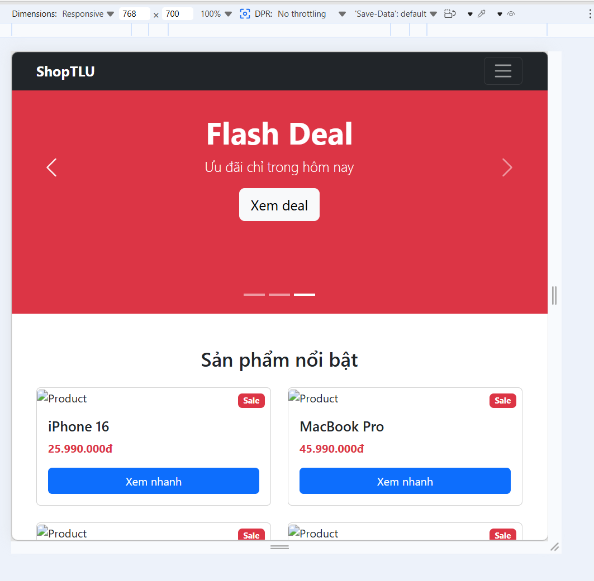
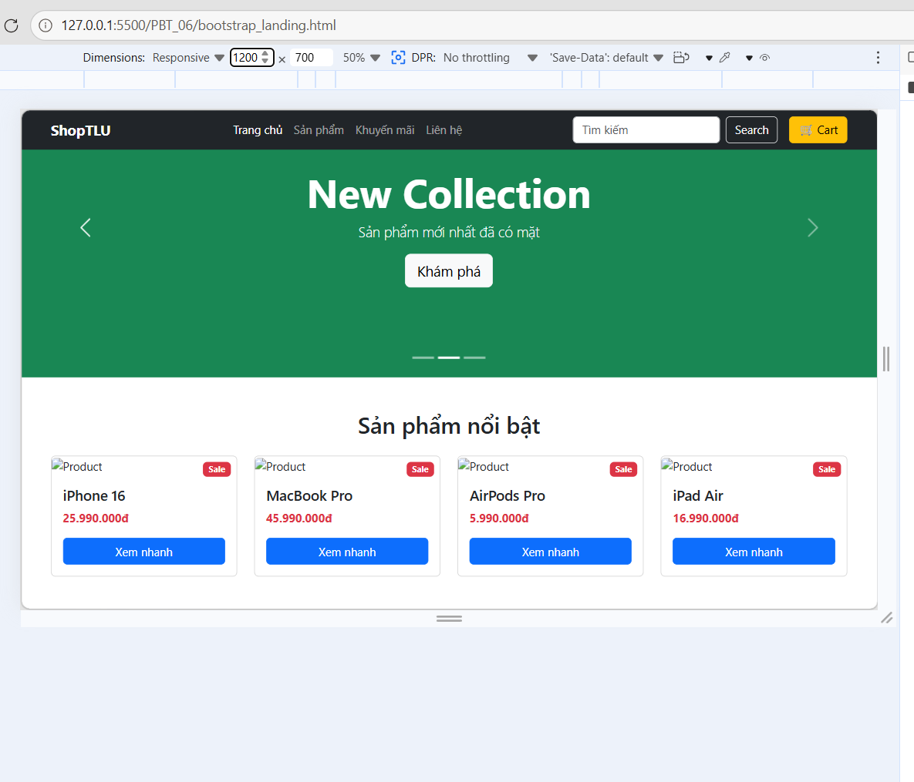
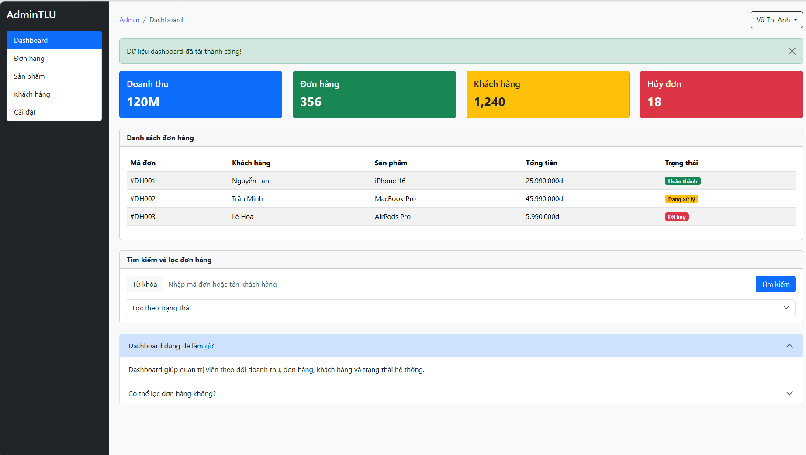

# PHẦN A — ĐỌC HIỂU

# Câu A1 — Grid System

## HTML đề bài

```html
<div class="container">
    <div class="row">
        <div class="col-12 col-md-6 col-lg-3">Box 1</div>
        <div class="col-12 col-md-6 col-lg-3">Box 2</div>
        <div class="col-12 col-md-6 col-lg-3">Box 3</div>
        <div class="col-12 col-md-6 col-lg-3">Box 4</div>
    </div>
</div>
```

## Bảng dự đoán layout

| Kích thước | < 768px | 768px - 991px | ≥ 992px |
|---|---|---|---|
| Class áp dụng chính | `col-12` | `col-md-6` | `col-lg-3` |
| Số cột mỗi box chiếm | 12/12 | 6/12 | 3/12 |
| Số box trên 1 hàng | 1 box | 2 box | 4 box |
| Box layout | 1 cột | 2 cột | 4 cột |

## 1. Mobile: dưới 768px

Áp dụng:

```html
col-12
```

Mỗi box chiếm toàn bộ 12 cột.

Sơ đồ:

```text
┌──────────────┐
│    Box 1     │
├──────────────┤
│    Box 2     │
├──────────────┤
│    Box 3     │
├──────────────┤
│    Box 4     │
└──────────────┘
```

→ 1 cột, 4 hàng.

## 2. Tablet: 768px - 991px

Áp dụng:

```html
col-md-6
```

Mỗi box chiếm 6/12 cột.

Một hàng có 2 box.

Sơ đồ:

```text
┌───────┬───────┐
│ Box 1 │ Box 2 │
├───────┼───────┤
│ Box 3 │ Box 4 │
└───────┴───────┘
```

→ 2 cột, 2 hàng.

## 3. Desktop: từ 992px trở lên

Áp dụng:

```html
col-lg-3
```

Mỗi box chiếm 3/12 cột.

Một hàng có 4 box.

Sơ đồ:

```text
┌──────┬──────┬──────┬──────┐
│Box 1 │Box 2 │Box 3 │Box 4 │
└──────┴──────┴──────┴──────┘
```

→ 4 cột, 1 hàng.

## Câu hỏi thêm

### col-md-6 nghĩa là gì?

`col-md-6` nghĩa là:

- Từ breakpoint `md` trở lên, tức là từ 768px
- Element chiếm 6 cột trong hệ grid 12 cột của Bootstrap

Vì:

```text
6 / 12 = 1/2
```

nên mỗi box chiếm nửa hàng.

### Tại sao không cần viết col-sm-12?

Vì đã có:

```html
col-12
```

`col-12` áp dụng cho tất cả kích thước màn hình từ nhỏ nhất trở lên.

Khi màn hình đạt `md` hoặc `lg`, các class sau sẽ ghi đè:

```html
col-md-6
col-lg-3
```

Vì vậy không cần viết thêm `col-sm-12`.

# Câu A2 — Utilities & Components

## 1. Giải thích class d-none d-md-block

```html
<div class="d-none d-md-block">
    Nội dung
</div>
```

### d-none

```text
display: none;
```

Element bị ẩn mặc định trên màn hình nhỏ.

### d-md-block

```text
Từ breakpoint md trở lên, display: block;
```

Breakpoint `md` của Bootstrap là từ 768px.

### Kết luận

Element sẽ:

- Ẩn trên mobile dưới 768px
- Hiển thị từ tablet 768px trở lên

## 2. Liệt kê 5 spacing utilities

### 1. mt-3

```text
margin-top mức 3
```

Dùng để tạo khoảng cách phía trên.

Ví dụ:

```html
<div class="mt-3">Box</div>
```

### 2. mb-4

```text
margin-bottom mức 4
```

Tạo khoảng cách phía dưới.

Ví dụ:

```html
<div class="mb-4">Box</div>
```
### 3. ms-2

```text
margin-start mức 2
```

Tạo khoảng cách phía bên trái trong giao diện LTR.

Ví dụ:

```html
<div class="ms-2">Box</div>
```

### 4. px-4

```text
padding-left và padding-right mức 4
```

Tạo padding ngang.

Ví dụ:

```html
<div class="px-4">Box</div>
```

### 5. py-3

```text
padding-top và padding-bottom mức 3
```

Tạo padding dọc.

Ví dụ:

```html
<div class="py-3">Box</div>
```

### 6. mb-auto

```text
margin-bottom: auto;
```

Dùng khi cần đẩy phần tử trong flex layout.

Ví dụ:

```html
<div class="mb-auto">Box</div>
```

## 3. Sự khác nhau giữa .container, .container-fluid, .container-md

### .container

```html
<div class="container">
```

- Có max-width thay đổi theo breakpoint
- Căn giữa nội dung
- Phù hợp layout web thông thường

### .container-fluid

```html
<div class="container-fluid">
```

- Luôn rộng 100% màn hình
- Không bị giới hạn max-width
- Phù hợp banner full width, layout toàn màn hình

### .container-md

```html
<div class="container-md">
```

- Dưới breakpoint `md`, nó rộng 100%
- Từ `md` trở lên, nó hoạt động giống container có max-width

Phù hợp khi muốn mobile full width nhưng tablet/desktop có giới hạn chiều rộng.

# Kết luận

Bootstrap giúp xây dựng responsive layout nhanh bằng:
- Grid system 12 cột
- Breakpoints như md, lg
- Utility classes cho spacing, display, layout
- Components có sẵn

# Bài B1 — Landing Page Bootstrap

## File đã tạo

- bootstrap_landing.html

## Các Bootstrap components đã dùng

- Navbar: `navbar navbar-expand-lg`
- Carousel: `carousel slide`
- Product cards: `card`, `card-img-top`, `card-body`
- Badge sale: `badge bg-danger`
- Modal: Bootstrap modal
- Footer grid: `row`, `col-12`, `col-md-6`, `col-lg-3`

## Responsive

Product grid sử dụng:

```html
col-12 col-md-6 col-lg-3
```
Nghĩa là:
    Mobile: 1 cột
    Tablet: 2 cột
    Desktop: 4 cột
## Screenshot




# Bài B2 — Dashboard Layout

## File đã tạo

- bootstrap_dashboard.html

## Thành phần Bootstrap đã sử dụng

- Sidebar cố định: `position-fixed`
- Menu dọc: `list-group`
- Topbar: `breadcrumb`, `dropdown`
- Stat cards: `card`, `bg-primary`, `bg-success`, `bg-warning`, `bg-danger`
- Table: `table`, `table-striped`, `table-hover`
- Form tìm kiếm: `input-group`, `form-select`
- FAQ: `accordion`
- Thông báo: `alert alert-success`

## Screenshot



# PHẦN C — PHÂN TÍCH

# Câu C1 — Tùy biến Bootstrap

## Đổi màu $primary sang #E63946

Muốn đổi màu `$primary` của Bootstrap từ xanh mặc định sang màu:

```text
#E63946
```

thì nên tùy biến bằng SASS/SCSS.

## Quy trình thực hiện

### Bước 1: Cần công cụ

Cần có:

- Bootstrap source SCSS
- Sass compiler
- Node.js / npm nếu dùng Bootstrap qua npm

Cài Bootstrap và Sass:

```bash
npm install bootstrap sass
```

### Bước 2: Tạo file SCSS riêng

Ví dụ tạo file:

```text
custom.scss
```
### Bước 3: Override biến trước khi import Bootstrap

Trong `custom.scss`:

```scss
$primary: #E63946;

@import "bootstrap/scss/bootstrap";
```

Lưu ý: phải đặt `$primary` trước khi import Bootstrap.

### Bước 4: Compile SCSS sang CSS

Chạy lệnh:

```bash
sass custom.scss custom.css
```

Sau đó trong HTML dùng file CSS đã compile:

```html
<link rel="stylesheet" href="custom.css">
```

## Tại sao không nên override trực tiếp .btn-primary?

Không nên làm như sau:

```css
.btn-primary {
    background: red;
}
```

vì cách này chỉ sửa riêng class `.btn-primary`.

Trong Bootstrap, màu `$primary` không chỉ dùng cho button mà còn dùng ở nhiều component khác như:

- `.btn-primary`
- `.bg-primary`
- `.text-primary`
- `.border-primary`
- alert
- badge
- link
- form focus

Nếu chỉ override `.btn-primary`, các component khác vẫn giữ màu xanh cũ, làm giao diện không đồng bộ.

## Vì sao nên dùng SASS variables?

Dùng biến:

```scss
$primary: #E63946;
```

giúp Bootstrap tự tạo lại toàn bộ hệ thống class liên quan đến màu primary.

Ưu điểm:

- Giao diện đồng bộ
- Dễ bảo trì
- Không cần ghi đè nhiều class
- Giảm CSS thừa
- Theo đúng cách tùy biến của Bootstrap

# Câu C2 — So sánh CSS thuần và Bootstrap

## 1. CSS thuần tạo navbar responsive + product card

### HTML ví dụ

```html
<header class="navbar">
    <div class="logo">ShopTLU</div>

    <button class="hamburger">☰</button>

    <nav class="menu">
        <a href="#">Home</a>
        <a href="#">Products</a>
        <a href="#">About</a>
    </nav>
</header>

<div class="card">
    
    <div class="card-body">
        <h3>iPhone 16</h3>
        <p>25.990.000đ</p>
        <button>Mua ngay</button>
    </div>
</div>
```

### CSS thuần

```css
* {
    box-sizing: border-box;
}

body {
    margin: 0;
    font-family: Arial, sans-serif;
}

.navbar {
    background-color: #1e293b;
    color: white;
    padding: 16px;

    display: flex;
    justify-content: space-between;
    align-items: center;
}

.logo {
    font-size: 24px;
    font-weight: bold;
}

.hamburger {
    display: block;
    background: none;
    border: none;
    color: white;
    font-size: 28px;
}

.menu {
    display: none;
}

.menu a {
    color: white;
    text-decoration: none;
    margin-left: 20px;
}

.card {
    width: 300px;
    margin: 30px;
    background-color: white;
    border: 1px solid #ddd;
    border-radius: 12px;
    overflow: hidden;
    box-shadow: 0 4px 12px rgba(0,0,0,0.15);
}

.card img {
    width: 100%;
    display: block;
}

.card-body {
    padding: 16px;
}

.card-body p {
    color: #dc2626;
    font-weight: bold;
}

.card-body button {
    width: 100%;
    padding: 12px;
    border: none;
    background-color: #2563eb;
    color: white;
    border-radius: 8px;
}

@media (min-width: 768px) {

    .hamburger {
        display: none;
    }

    .menu {
        display: flex;
    }
}
```

## 2. Bootstrap version

### Navbar Bootstrap

```html
<nav class="navbar navbar-expand-md navbar-dark bg-dark">
    <div class="container">
        <a class="navbar-brand" href="#">ShopTLU</a>

        <button class="navbar-toggler" data-bs-toggle="collapse" data-bs-target="#menu">
            <span class="navbar-toggler-icon"></span>
        </button>

        <div class="collapse navbar-collapse" id="menu">
            <ul class="navbar-nav ms-auto">
                <li class="nav-item"><a class="nav-link" href="#">Home</a></li>
                <li class="nav-item"><a class="nav-link" href="#">Products</a></li>
                <li class="nav-item"><a class="nav-link" href="#">About</a></li>
            </ul>
        </div>
    </div>
</nav>
```

### Product card Bootstrap

```html
<div class="card" style="width: 18rem;">
    

    <div class="card-body">
        <h5 class="card-title">iPhone 16</h5>
        <p class="card-text text-danger fw-bold">25.990.000đ</p>
        <button class="btn btn-primary w-100">Mua ngay</button>
    </div>
</div>
```
# Bảng so sánh

| Tiêu chí | CSS thuần | Bootstrap |
|---|---|---|
| Số dòng CSS cần viết | Nhiều, khoảng 60-100 dòng | Ít hoặc gần như không cần CSS |
| Thời gian phát triển | Lâu hơn | Nhanh hơn |
| Responsive | Phải tự viết media queries | Có sẵn grid và breakpoint |
| Khả năng tùy biến | Cao, tự do hoàn toàn | Nhanh nhưng dễ giống Bootstrap mặc định |
| Độ khó | Cần hiểu CSS kỹ | Dễ hơn khi đã nhớ class |
| Phù hợp | Website cần thiết kế riêng | Prototype, admin, landing page nhanh |

## Khi nào nên dùng Bootstrap?

Nên dùng Bootstrap khi:

- Cần làm giao diện nhanh
- Làm dashboard/admin
- Làm landing page
- Làm prototype
- Project không yêu cầu thiết kế quá khác biệt
- Muốn responsive nhanh

## Khi nào không nên dùng Bootstrap?

Không nên dùng Bootstrap khi:

- Website cần giao diện rất riêng
- Muốn tối ưu CSS nhẹ nhất
- Không muốn HTML nhiều class
- Project yêu cầu design system riêng
- Muốn kiểm soát toàn bộ style

# Kết luận

Bootstrap giúp làm giao diện nhanh và responsive tốt với ít CSS.  
Tuy nhiên CSS thuần cho khả năng tùy biến cao hơn và phù hợp khi cần giao diện độc đáo.