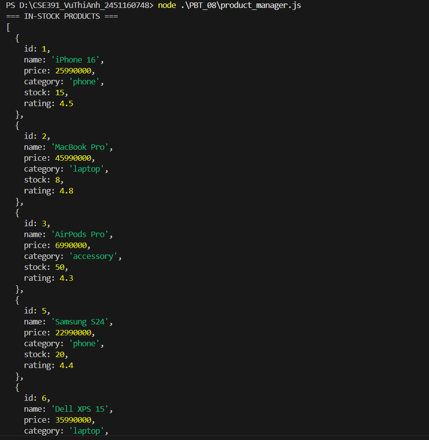
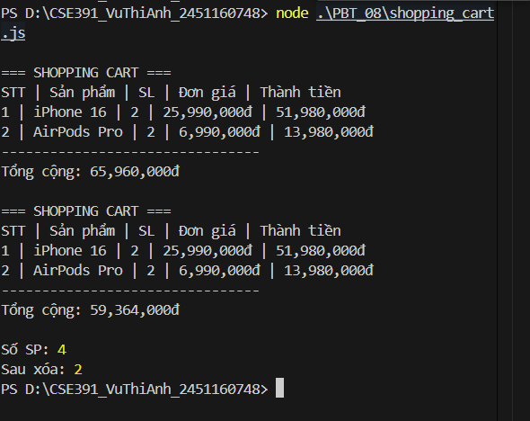
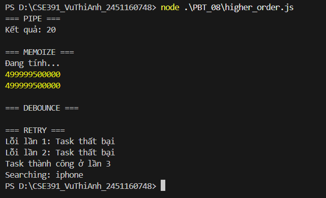

# PHẦN A — KIỂM TRA ĐỌC HIỂU

# Câu A1 — Function Declaration vs Expression vs Arrow Function

## Yêu cầu

Tính:

- Thuế = 10% nếu lương > 11.000.000
- Thuế = 0% nếu lương ≤ 11.000.000

Trả về object:

```js
{
    thue,
    thuc_nhan
}
```

# 1. Function Declaration

```js
function tinhThueBaoHiem(luong) {

    let thue = 0;

    if (luong > 11000000) {
        thue = luong * 0.1;
    }

    return {
        thue: thue,
        thuc_nhan: luong - thue
    };
}
```

Ví dụ:

```js
console.log(tinhThueBaoHiem(15000000));
```

Kết quả:

```js
{
    thue: 1500000,
    thuc_nhan: 13500000
}
```

# 2. Function Expression

```js
const tinhThueBaoHiem2 = function (luong) {

    let thue = 0;

    if (luong > 11000000) {
        thue = luong * 0.1;
    }

    return {
        thue: thue,
        thuc_nhan: luong - thue
    };
};
```

Ví dụ:

```js
console.log(tinhThueBaoHiem2(15000000));
```

# 3. Arrow Function

```js
const tinhThueBaoHiem3 = (luong) => {

    let thue = 0;

    if (luong > 11000000) {
        thue = luong * 0.1;
    }

    return {
        thue: thue,
        thuc_nhan: luong - thue
    };
};
```

Ví dụ:

```js
console.log(tinhThueBaoHiem3(15000000));
```

# So sánh Hoisting

## Function Declaration

Có hoisting hoàn toàn.

Ví dụ:

```js
console.log(cong(2, 3));

function cong(a, b) {
    return a + b;
}
```

Kết quả:

```text
5
```

Vẫn chạy được mặc dù gọi hàm trước khi khai báo.

## Function Expression

Không hoisting phần giá trị hàm.

Ví dụ:

```js
console.log(cong(2, 3));

const cong = function(a, b) {
    return a + b;
};
```

Kết quả:

```text
ReferenceError
```

## Arrow Function

Hoạt động giống Function Expression.

Ví dụ:

```js
console.log(cong(2, 3));

const cong = (a, b) => a + b;
```

Kết quả:

```text
ReferenceError
```

# Bảng so sánh

| Tiêu chí | Function Declaration | Function Expression | Arrow Function |
|-----------|---------------------|---------------------|----------------|
| Cú pháp | function tenHam() | const tenHam = function() | const tenHam = () => |
| Hoisting | Có | Không | Không |
| Gọi trước khai báo | Được | Không | Không |
| Ngắn gọn | Trung bình | Trung bình | Ngắn gọn nhất |
| this | this riêng | this riêng | Kế thừa this bên ngoài |

# Kết luận

- Function Declaration được hoisting hoàn toàn nên có thể gọi trước khi khai báo.
- Function Expression và Arrow Function không thể gọi trước khi khai báo.
- Trong JavaScript hiện đại, Arrow Function thường được sử dụng nhiều nhất vì cú pháp ngắn gọn và dễ đọc.

# Câu A2 — Scope & Closure

## Đoạn 1

```js
function counter() {
    let count = 0;

    return {
        increment: () => ++count,
        decrement: () => --count,
        getCount: () => count
    };
}

const c = counter();

console.log(c.increment());
console.log(c.increment());
console.log(c.increment());
console.log(c.decrement());
console.log(c.getCount());
```

## Dự đoán output

```text
1
2
3
2
2
```

## Giải thích

Khi gọi:

```js
const c = counter();
```

hàm `counter()` tạo ra biến:

```js
let count = 0;
```

Sau đó trả về object gồm 3 hàm:

```js
increment
decrement
getCount
```

Ba hàm này vẫn nhớ và sử dụng được biến `count` bên trong `counter()`.

Đây gọi là **closure**.

## Phân tích từng dòng

```js
console.log(c.increment());
```

`count` tăng từ 0 lên 1.

Kết quả:

```text
1
```
```js
console.log(c.increment());
```

`count` tăng từ 1 lên 2.

Kết quả:

```text
2
```
```js
console.log(c.increment());
```

`count` tăng từ 2 lên 3.

Kết quả:

```text
3
```
```js
console.log(c.decrement());
```

`count` giảm từ 3 xuống 2.

Kết quả:

```text
2
```
```js
console.log(c.getCount());
```

Lấy giá trị hiện tại của `count`.

Kết quả:

```text
2
```

# Đoạn 2

```js
for (var i = 0; i < 3; i++) {
    setTimeout(() => console.log("var:", i), 100);
}

for (let j = 0; j < 3; j++) {
    setTimeout(() => console.log("let:", j), 200);
}
```

## Dự đoán output sau 200ms

```text
var: 3
var: 3
var: 3
let: 0
let: 1
let: 2
```
# Giải thích var trong setTimeout

Vòng lặp:

```js
for (var i = 0; i < 3; i++)
```

`var` có **function scope**, không có block scope.

Điều đó có nghĩa là cả 3 lần `setTimeout` đều dùng chung một biến `i`.

Khi vòng lặp chạy xong:

```js
i = 3
```

Sau 100ms, các callback mới chạy. Lúc đó `i` đã bằng 3.

Vì vậy in ra:

```text
var: 3
var: 3
var: 3
```

# Giải thích let trong setTimeout

Vòng lặp:

```js
for (let j = 0; j < 3; j++)
```

`let` có **block scope**.

Mỗi lần lặp sẽ tạo ra một biến `j` riêng.

Nên các callback ghi nhớ từng giá trị khác nhau:

```text
j = 0
j = 1
j = 2
```

Sau 200ms, kết quả là:

```text
let: 0
let: 1
let: 2
```
# Kết luận

## var

```js
var
```

- Có function scope
- Dùng chung một biến trong vòng lặp
- Dễ gây lỗi khi dùng với callback bất đồng bộ như `setTimeout`

## let

```js
let
```

- Có block scope
- Mỗi vòng lặp có một biến riêng
- Phù hợp hơn khi dùng trong vòng lặp

Vì vậy trong JavaScript hiện đại, nên dùng:

```js
let
```

thay cho:

```js
var
```

trong vòng lặp.
# Câu A3 — Array Methods

## Mảng ban đầu

```js
const nums = [1, 2, 3, 4, 5, 6, 7, 8, 9, 10];
```

## 1. Lấy các số chẵn

Kết quả:

```js
[2, 4, 6, 8, 10]
```

Code:

```js
nums.filter(n => n % 2 === 0);
```

## 2. Nhân mỗi số với 3

Kết quả:

```js
[3, 6, 9, 12, 15, 18, 21, 24, 27, 30]
```

Code:

```js
nums.map(n => n * 3);
```


## 3. Tính tổng tất cả

Kết quả:

```js
55
```

Code:

```js
nums.reduce((sum, n) => sum + n, 0);
```

## 4. Tìm số đầu tiên lớn hơn 7

Kết quả:

```js
8
```

Code:

```js
nums.find(n => n > 7);
```

## 5. Kiểm tra có số nào lớn hơn 10 không

Kết quả:

```js
false
```

Code:

```js
nums.some(n => n > 10);
```

## 6. Kiểm tra tất cả đều lớn hơn 0

Kết quả:

```js
true
```

Code:

```js
nums.every(n => n > 0);
```

## 7. Tạo mảng "Số X là chẵn/lẻ"

Kết quả:

```js
[
  "Số 1 là lẻ",
  "Số 2 là chẵn",
  "Số 3 là lẻ",
  ...
]
```

Code:

```js
nums.map(n => `Số ${n} là ${n % 2 === 0 ? "chẵn" : "lẻ"}`);
```

## 8. Đảo ngược mảng (không làm thay đổi mảng gốc)

Kết quả:

```js
[10, 9, 8, 7, 6, 5, 4, 3, 2, 1]
```

Code:

```js
[...nums].reverse();
```

# Bảng tổng hợp

| Yêu cầu | Array Method |
|----------|-------------|
| Lọc số chẵn | filter() |
| Nhân mỗi phần tử | map() |
| Tính tổng | reduce() |
| Tìm phần tử đầu tiên | find() |
| Kiểm tra tồn tại | some() |
| Kiểm tra tất cả | every() |
| Chuyển đổi dữ liệu | map() |
| Đảo mảng không mutate | spread + reverse() |


# Kết luận

Các phương thức mảng quan trọng nhất:

```js
filter()
map()
reduce()
find()
some()
every()
```

Giúp xử lý dữ liệu ngắn gọn, dễ đọc và thường được sử dụng trong JavaScript hiện đại.

# Câu A4 — Object Destructuring & Spread

## Code

```js
const product = {
    name: "iPhone 16",
    price: 25990000,
    specs: {
        ram: 8,
        storage: 256,
        color: "Titan"
    }
};

// Destructuring
const {
    name,
    price,
    specs: { ram, color }
} = product;

console.log(name, price, ram, color);
console.log(specs);

// Spread
const updated = {
    ...product,
    price: 23990000,
    sale: true
};

console.log(updated.price);
console.log(updated.sale);
console.log(product.price);

// Spread gotcha
const copy = { ...product };

copy.specs.ram = 16;

console.log(product.specs.ram);
```
# 1. Destructuring

```js
const {
    name,
    price,
    specs: { ram, color }
} = product;
```

## Output

```js
console.log(name, price, ram, color);
```

Kết quả:

```text
iPhone 16 25990000 8 Titan
```

### Giải thích

Từ object:

```js
product = {
    name: "iPhone 16",
    price: 25990000,
    specs: {
        ram: 8,
        color: "Titan"
    }
}
```

Destructuring lấy:

```js
name = "iPhone 16"
price = 25990000
ram = 8
color = "Titan"
```

# 2. console.log(specs)

```js
console.log(specs);
```

## Output

```text
ReferenceError: specs is not defined
```

### Giải thích

Ta chỉ destructure:

```js
specs: { ram, color }
```

Nghĩa là chỉ tạo biến:

```js
ram
color
```

Không tạo biến:

```js
specs
```

Vì vậy:

```js
console.log(specs);
```

sẽ lỗi.

# 3. Spread Operator

```js
const updated = {
    ...product,
    price: 23990000,
    sale: true
};
```

## Output

```js
console.log(updated.price);
```

Kết quả:

```text
23990000
```

## Output

```js
console.log(updated.sale);
```

Kết quả:

```text
true
```

## Output

```js
console.log(product.price);
```

Kết quả:

```text
25990000
```

### Giải thích

Spread tạo object mới:

```js
updated
```

nên thay đổi:

```js
price: 23990000
```

không làm ảnh hưởng object gốc.

# 4. Spread Gotcha

```js
const copy = { ...product };
```

Nhiều người nghĩ đây là copy hoàn toàn.

Thực tế:

```js
Spread chỉ copy nông (shallow copy)
```

## Sau đó

```js
copy.specs.ram = 16;
```

Ta thay đổi:

```js
specs.ram
```


## Output

```js
console.log(product.specs.ram);
```

Kết quả:

```text
16
```

## Tại sao?

Vì:

```js
product.specs
```

và

```js
copy.specs
```

đang cùng trỏ tới một object trong bộ nhớ.

Minh họa:

```text
product
 └─ specs ─┐
           │
copy   ────┘
```

Nên khi sửa:

```js
copy.specs.ram = 16;
```

thì:

```js
product.specs.ram
```

cũng đổi thành:

```text
16
```

# Bảng tổng hợp

| Câu lệnh | Kết quả |
|-----------|----------|
| console.log(name, price, ram, color) | iPhone 16 25990000 8 Titan |
| console.log(specs) | ReferenceError |
| console.log(updated.price) | 23990000 |
| console.log(updated.sale) | true |
| console.log(product.price) | 25990000 |
| console.log(product.specs.ram) | 16 |

# Kết luận

## Destructuring

Cho phép lấy nhanh dữ liệu từ object:

```js
const { name, price } = product;
```

## Spread Operator

```js
const copy = { ...product };
```

chỉ tạo:

```text
Shallow Copy
```

không phải:

```text
Deep Copy
```
## Lưu ý quan trọng

Với object lồng nhau:

```js
specs
```

spread sẽ sao chép tham chiếu.

Do đó:

```js
copy.specs.ram = 16;
```

sẽ làm thay đổi cả:

```js
product.specs.ram
```

Kết quả cuối cùng:

```text
16
```
## Bài B1 — Quản lý Sản phẩm E-Commerce

Đã tạo file:

product_manager.js

Sử dụng đầy đủ:

- filter()
- map()
- reduce()
- sort()
- find()/includes()

Chức năng:

1. Lọc sản phẩm còn hàng
2. Lọc theo danh mục và khoảng giá
3. Sắp xếp theo giá
4. Tìm sản phẩm rẻ nhất mỗi danh mục
5. Tính tổng giá trị kho
6. Định dạng danh sách sản phẩm
7. Tính rating trung bình
8. Tìm kiếm sản phẩm theo từ khóa


## Bài B2 — Shopping Cart

Đã tạo file:

shopping_cart.js

Áp dụng Closure:

```js
function createCart() {
    let items = [];
}
```
Private data:

items
discount
freeShip

Các chức năng:

addItem()
removeItem()
updateQuantity()
getTotal()
applyDiscount()
printCart()
getItemCount()
clearCart()

Mã giảm giá:

SALE10 → giảm 10%
SALE20 → giảm 20%
FREESHIP → giảm 30.000đ


## Bài B3 — Higher-Order Functions Challenge

Đã tạo file:

higher_order.js

Các hàm đã viết:

- pipe(...fns): nối nhiều hàm lại thành một pipeline xử lý dữ liệu.
- memoize(fn): cache kết quả để không tính lại nếu input giống nhau.
- debounce(fn, delay): chỉ chạy hàm sau khi người dùng ngừng gọi trong một khoảng thời gian.
- retry(fn, maxAttempts): thử chạy lại hàm async nếu bị lỗi.

Kết quả kiểm tra:

- pipe(5) trả về "Kết quả: 20"
- memoize chỉ in "Đang tính..." ở lần gọi đầu tiên.
- debounce chỉ chạy lần gọi cuối cùng.
- retry thử lại đến khi task thành công hoặc hết số lần thử.


# PHẦN C — SUY LUẬN

# Câu C1 — Refactor Code

## Code sau khi refactor

```js
const processOrders = (orders) =>
    orders
        .filter(({ status, total }) => status === "completed" && total > 100000)
        .map(({ id, customer, total }) => {
            const discount = total * 0.1;
            return {
                id,
                customer,
                total,
                discount,
                finalTotal: total - discount
            };
        })
        .sort((a, b) => b.finalTotal - a.finalTotal);
```

## Giải thích

### 1. filter()

```js
.filter(({ status, total }) => status === "completed" && total > 100000)
```

Dùng để lọc các đơn hàng:

- Có trạng thái `completed`
- Có tổng tiền lớn hơn `100000`

---

### 2. map()

```js
.map(({ id, customer, total }) => { ... })
```

Dùng để tạo mảng mới chỉ gồm các thông tin cần thiết:

- id
- customer
- total
- discount
- finalTotal
### 3. destructuring

```js
({ id, customer, total })
```

Dùng để lấy nhanh các thuộc tính từ object `order`.
### 4. sort()

```js
.sort((a, b) => b.finalTotal - a.finalTotal)
```

Dùng để sắp xếp theo `finalTotal` giảm dần.

## Kết luận

Code mới ngắn gọn hơn vì sử dụng:

- Arrow function
- filter()
- map()
- sort()
- Destructuring

Thay vì dùng nhiều vòng lặp `for`, nhiều `if` lồng nhau và thuật toán sort thủ công.
# Câu C2 — Thiết kế API miniArray

## Yêu cầu

Thiết kế thư viện nhỏ `miniArray` gồm 3 hàm tự viết:

- map()
- filter()
- reduce()

Không dùng built-in:

```js
Array.prototype.map()
Array.prototype.filter()
Array.prototype.reduce()
```

---

## Code

```js
const miniArray = {
    map(arr, fn) {
        const result = [];

        for (let i = 0; i < arr.length; i++) {
            result.push(fn(arr[i], i, arr));
        }

        return result;
    },

    filter(arr, fn) {
        const result = [];

        for (let i = 0; i < arr.length; i++) {
            if (fn(arr[i], i, arr)) {
                result.push(arr[i]);
            }
        }

        return result;
    },

    reduce(arr, fn, initialValue) {
        let accumulator = initialValue;

        for (let i = 0; i < arr.length; i++) {
            accumulator = fn(accumulator, arr[i], i, arr);
        }

        return accumulator;
    }
};

console.log(miniArray.map([1, 2, 3], x => x * 2));
console.log(miniArray.filter([1, 2, 3, 4], x => x > 2));
console.log(miniArray.reduce([1, 2, 3, 4], (a, b) => a + b, 0));
```

---

## Kết quả

```text
[2, 4, 6]
[3, 4]
10
```

---

# Giải thích

## 1. miniArray.map()

```js
map(arr, fn) {
    const result = [];

    for (let i = 0; i < arr.length; i++) {
        result.push(fn(arr[i], i, arr));
    }

    return result;
}
```

### Cách hoạt động

- Tạo mảng rỗng `result`
- Duyệt từng phần tử của `arr`
- Gọi hàm `fn` với từng phần tử
- Đẩy kết quả vào `result`
- Trả về mảng mới

Ví dụ:

```js
miniArray.map([1, 2, 3], x => x * 2)
```

Kết quả:

```js
[2, 4, 6]
```

---

## 2. miniArray.filter()

```js
filter(arr, fn) {
    const result = [];

    for (let i = 0; i < arr.length; i++) {
        if (fn(arr[i], i, arr)) {
            result.push(arr[i]);
        }
    }

    return result;
}
```

### Cách hoạt động

- Tạo mảng rỗng `result`
- Duyệt từng phần tử
- Nếu `fn()` trả về `true`, thêm phần tử đó vào `result`
- Trả về mảng đã lọc

Ví dụ:

```js
miniArray.filter([1, 2, 3, 4], x => x > 2)
```

Kết quả:

```js
[3, 4]
```

---

## 3. miniArray.reduce()

```js
reduce(arr, fn, initialValue) {
    let accumulator = initialValue;

    for (let i = 0; i < arr.length; i++) {
        accumulator = fn(accumulator, arr[i], i, arr);
    }

    return accumulator;
}
```

### Cách hoạt động

- `accumulator` nhận giá trị ban đầu là `initialValue`
- Duyệt từng phần tử của mảng
- Cập nhật `accumulator` bằng kết quả của `fn`
- Trả về giá trị cuối cùng

Ví dụ:

```js
miniArray.reduce([1, 2, 3, 4], (a, b) => a + b, 0)
```

Quá trình:

```text
0 + 1 = 1
1 + 2 = 3
3 + 3 = 6
6 + 4 = 10
```

Kết quả:

```text
10
```

---

# Kết luận

`miniArray` mô phỏng lại các phương thức mảng phổ biến trong JavaScript bằng vòng lặp `for`.

Các hàm này là higher-order functions vì chúng nhận một function khác làm tham số:

```js
fn
```

Ví dụ:

```js
x => x * 2
```

là callback function truyền vào `miniArray.map()`.