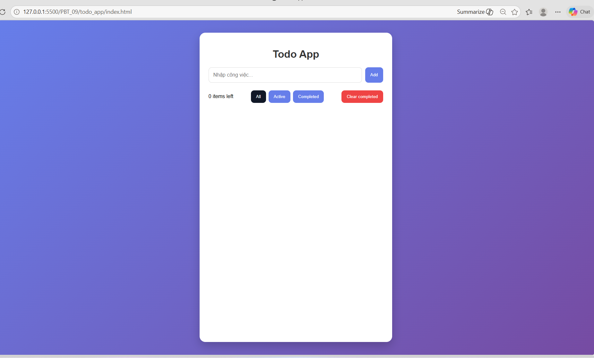
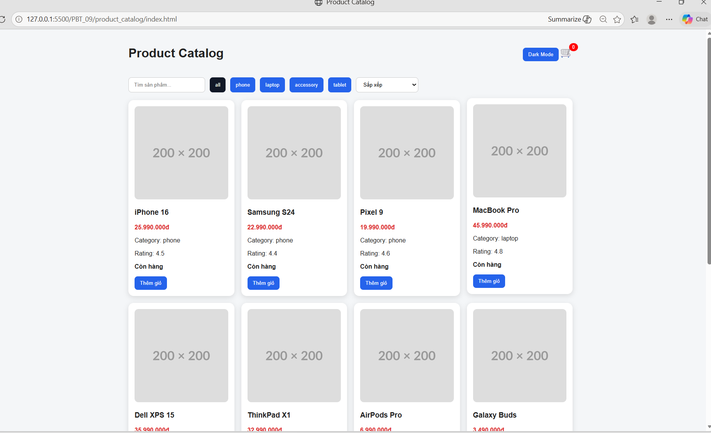
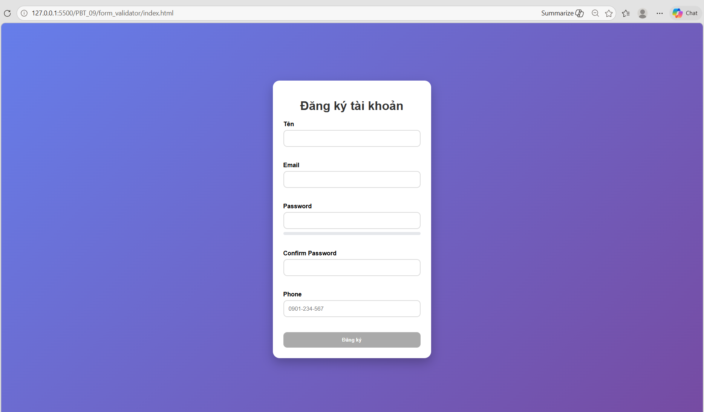
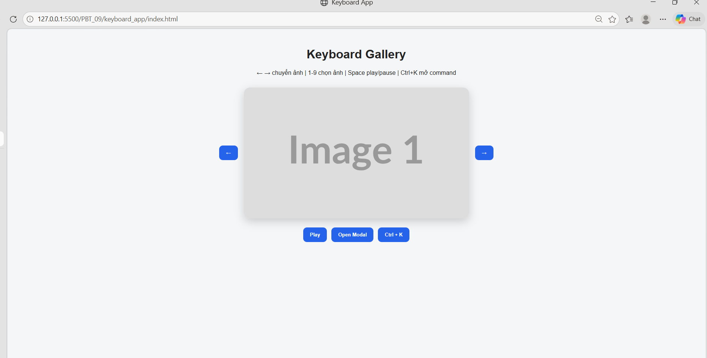

# PHẦN A — KIỂM TRA ĐỌC HIỂU

# Câu A1 — DOM Tree

## DOM Tree

```text
div#app
│
├── header
│   │
│   ├── h1
│   │   └── "Todo App"
│   │
│   └── nav
│       │
│       ├── a.active
│       │   └── "All"
│       │
│       ├── a
│       │   └── "Active"
│       │
│       └── a
│           └── "Completed"
│
└── main
    │
    ├── form#todoForm
    │   │
    │   ├── input#todoInput
    │   │
    │   └── button
    │       └── "Add"
    │
    └── ul#todoList
        │
        ├── li.todo-item
        │   └── "Learn HTML"
        │
        └── li.todo-item.completed
            └── "Learn CSS"
```


# Query Selector

## 1. Chọn thẻ h1

```js
document.querySelector("h1");
```

## 2. Chọn input trong form

```js
document.querySelector("#todoForm input");
```

Hoặc:

```js
document.querySelector("#todoInput");
```

## 3. Chọn tất cả .todo-item

```js
document.querySelectorAll(".todo-item");
```

## 4. Chọn link đang active

```js
document.querySelector("a.active");
```

Hoặc:

```js
document.querySelector("nav a.active");
```

## 5. Chọn li đầu tiên trong #todoList

```js
document.querySelector("#todoList li");
```

Hoặc:

```js
document.querySelector("#todoList li:first-child");
```


## 6. Chọn tất cả a bên trong nav

```js
document.querySelectorAll("nav a");
```

# Bảng tổng hợp

| Yêu cầu | querySelector |
|----------|---------------|
| Chọn h1 | `document.querySelector("h1")` |
| Chọn input trong form | `document.querySelector("#todoForm input")` |
| Chọn tất cả todo-item | `document.querySelectorAll(".todo-item")` |
| Chọn link active | `document.querySelector("a.active")` |
| Chọn li đầu tiên | `document.querySelector("#todoList li:first-child")` |
| Chọn tất cả link trong nav | `document.querySelectorAll("nav a")` |


# Kết luận

Các hàm DOM được dùng nhiều nhất:

```js
document.querySelector()
document.querySelectorAll()
```

Cho phép chọn phần tử bằng:

- Tag name
- Class
- ID
- CSS selector
- Pseudo selector

# Câu A2 — innerHTML vs textContent

## 1. innerHTML là gì?

`innerHTML` dùng để lấy hoặc gán **nội dung HTML** bên trong một element.

Nếu chuỗi có thẻ HTML, trình duyệt sẽ hiểu và render thành HTML thật.

### Ví dụ

```html
<div id="result"></div>
```

```js
document.querySelector("#result").innerHTML = "<strong>Hello</strong>";
```

Kết quả hiển thị:

```text
Hello
```

Chữ `Hello` được in đậm vì `<strong>` được hiểu là thẻ HTML.


## 2. textContent là gì?

`textContent` dùng để lấy hoặc gán **nội dung dạng text thuần**.

Nếu chuỗi có thẻ HTML, trình duyệt không render thẻ đó mà hiển thị như chữ bình thường.

### Ví dụ

```html
<div id="result"></div>
```

```js
document.querySelector("#result").textContent = "<strong>Hello</strong>";
```

Kết quả hiển thị:

```text
<strong>Hello</strong>
```


# Khi nào dùng innerHTML?

Dùng `innerHTML` khi mình **chủ động tạo HTML an toàn**.

Ví dụ:

```js
document.querySelector("#result").innerHTML = `
    <h2>Danh sách sản phẩm</h2>
    <p>Sản phẩm đang giảm giá</p>
`;
```

Nên dùng khi dữ liệu không đến trực tiếp từ người dùng.


# Khi nào dùng textContent?

Dùng `textContent` khi hiển thị dữ liệu do người dùng nhập vào.

Ví dụ:

```js
const userInput = document.querySelector("#search").value;

document.querySelector("#result").textContent = userInput;
```

Cách này an toàn hơn vì trình duyệt chỉ coi dữ liệu là text.

# Bảng so sánh

| Tiêu chí | innerHTML | textContent |
|----------|-----------|-------------|
| Hiểu thẻ HTML | Có | Không |
| Render HTML | Có | Không |
| Hiển thị text thuần | Có thể | Có |
| Nguy cơ XSS | Cao hơn | An toàn hơn |
| Nên dùng với input user | Không nên | Nên |

# Câu hỏi bảo mật: Vì sao innerHTML có thể gây XSS?

XSS là lỗ hổng cho phép kẻ tấn công chèn mã độc vào trang web.

Nếu đưa dữ liệu người dùng nhập trực tiếp vào `innerHTML`, trình duyệt có thể hiểu chuỗi đó như HTML thật.


## Ví dụ nguy hiểm

Giả sử user nhập:

```html

```

Code nguy hiểm:

```js
const userInput = document.querySelector("#search").value;

document.querySelector("#result").innerHTML = userInput;
```

Khi đó trình duyệt sẽ tạo thẻ:

```html

```

và chạy sự kiện:

```js
onerror="alert('Hacked!')"
```

Điều này gây nguy hiểm vì mã JavaScript của người dùng có thể được thực thi.

# Cách sửa an toàn

Thay `innerHTML` bằng `textContent`.

```js
const userInput = document.querySelector("#search").value;

document.querySelector("#result").textContent = userInput;
```

Khi đó chuỗi:

```html

```

sẽ chỉ được hiển thị như text bình thường, không chạy mã độc.


# Cách khác: tạo element bằng DOM API

```js
const userInput = document.querySelector("#search").value;

const result = document.querySelector("#result");
result.textContent = "";

const p = document.createElement("p");
p.textContent = userInput;

result.appendChild(p);
```

Cách này cũng an toàn vì dữ liệu user được đưa vào bằng `textContent`.

# Kết luận

- Dùng `innerHTML` khi nội dung HTML do lập trình viên kiểm soát.
- Dùng `textContent` khi hiển thị dữ liệu người dùng nhập.
- Không nên đưa trực tiếp input của user vào `innerHTML` vì có thể gây XSS.

# Câu A3 — Event Bubbling

## Code

```js
document.querySelector("#outer").addEventListener("click", () => {
    console.log("OUTER");
});

document.querySelector("#inner").addEventListener("click", () => {
    console.log("INNER");
});

document.querySelector("#btn").addEventListener("click", (e) => {
    console.log("BUTTON");

    // e.stopPropagation();
});
```

```html
<div id="outer">
    <div id="inner">
        <button id="btn">Click me</button>
    </div>
</div>
```

# Khi click vào button

Phần tử được click là:

```html
<button id="btn">
```

Sau khi xử lý ở button, sự kiện sẽ nổi bọt (**Event Bubbling**) từ trong ra ngoài:

```text
btn
↑
inner
↑
outer
```

## Output

```text
BUTTON
INNER
OUTER
```

# Giải thích

### Bước 1

Click vào:

```html
<button id="btn">
```

Listener của button chạy trước:

```js
console.log("BUTTON");
```

Kết quả:

```text
BUTTON
```
### Bước 2

Event nổi bọt lên parent:

```html
<div id="inner">
```

Chạy:

```js
console.log("INNER");
```

Kết quả:

```text
INNER
```

### Bước 3

Event tiếp tục nổi bọt lên:

```html
<div id="outer">
```

Chạy:

```js
console.log("OUTER");
```

Kết quả:

```text
OUTER
```

# Kết quả cuối cùng

```text
BUTTON
INNER
OUTER
```

# Nếu bỏ comment stopPropagation()

```js
document.querySelector("#btn").addEventListener("click", (e) => {
    console.log("BUTTON");

    e.stopPropagation();
});
```

## Output

```text
BUTTON
```
# Tại sao?

`stopPropagation()` dừng quá trình Event Bubbling.

Sau khi xử lý ở button:

```js
console.log("BUTTON");
```

sự kiện sẽ không truyền lên:

```html
#inner
```

và:

```html
#outer
```

nữa.

Do đó:

```text
INNER
```

và:

```text
OUTER
```

không được in ra.

# So sánh

| Trường hợp | Output |
|------------|---------|
| Không dùng stopPropagation() | BUTTON → INNER → OUTER |
| Có stopPropagation() | BUTTON |

# Event Bubbling là gì?

Event Bubbling là cơ chế mặc định của DOM:

```text
Phần tử con
    ↑
Phần tử cha
    ↑
Ông nội
    ↑
document
```

Sự kiện được kích hoạt ở phần tử được click trước, sau đó lan dần lên các phần tử cha.

Ví dụ:

```html
button
→ div
→ body
→ html
→ document
```

# Kết luận

Khi click button:

```text
BUTTON
INNER
OUTER
```

Khi dùng:

```js
e.stopPropagation();
```

thì:

```text
BUTTON
```

vì sự kiện không tiếp tục nổi bọt lên các phần tử cha.

# Bài B1 — Todo App hoàn chỉnh

Đã tạo folder:

todo_app/

Gồm 3 file:

- index.html
- style.css
- app.js

Chức năng đã làm:

- Thêm todo bằng Enter hoặc nút Add
- Xóa todo bằng nút ❌
- Toggle completed khi click vào text
- Đếm số todo chưa hoàn thành
- Filter: All / Active / Completed
- Clear completed
- Edit todo bằng double-click
- Lưu dữ liệu bằng localStorage
- Dùng addEventListener
- Dùng createElement để tạo todo item
- Dùng Event Delegation trên #todoList


# Bài B2 — Interactive Product Catalog

Đã tạo folder:

product_catalog/

Gồm 3 file:

- index.html
- style.css
- app.js

Chức năng đã hoàn thành:

- Render sản phẩm từ mảng JavaScript
- Tạo card bằng createElement
- Search realtime bằng event input
- Filter theo category
- Sort theo giá tăng, giá giảm, tên A-Z, rating cao nhất
- Click card mở modal chi tiết
- Click "Thêm giỏ" tăng badge giỏ hàng
- Dark mode toggle
- Tách function rõ ràng:
  - renderProducts()
  - filterByCategory()
  - searchProducts()
  - sortProducts()



# Bài B3 — Form Validator

Đã tạo folder:

form_validator/

Gồm 3 file:

- index.html
- style.css
- app.js

Chức năng đã hoàn thành:

- Validate tên realtime từ 2 đến 50 ký tự
- Validate email bằng regex
- Password strength meter: yếu, trung bình, mạnh
- Progress bar đổi màu theo độ mạnh mật khẩu
- Confirm password kiểm tra realtime
- Phone tự format dạng 0901-234-567
- Submit button disabled cho đến khi tất cả field hợp lệ
- Submit thành công hiển thị modal thông tin đã nhập


# Bài B4 — Keyboard Shortcuts & Accessibility

Đã tạo folder:

keyboard_app/

Gồm 3 file:

- index.html
- style.css
- app.js

Chức năng đã hoàn thành:

- Gallery ảnh
- Phím ← → để chuyển ảnh
- Phím 1-9 để nhảy đến ảnh tương ứng
- Space để play/pause slideshow
- Escape để đóng modal
- Ctrl + K mở command palette
- Gõ keyword để lọc command
- Enter để chọn command
- Escape để đóng command palette
- Tab di chuyển qua các element
- Focus ring visible
- Có aria-label trên các interactive elements

